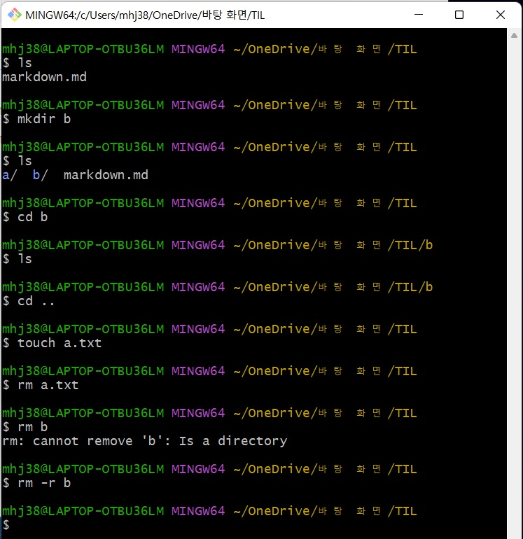

# 221227 학습내용 총정리

## 1. 마크다운
    - 텍스트 기반
    - 변환
### **마크다운 문법**
#### 1. Heading: 문서의 제목이나 소제목
   - #의 개수에 따라 대응되는 수준(Heading level)이 있음
   - h1~h6까지 표현 가능
   - 문서의 구조를 위해 작성되며 글자 크기를 조절하기 위해 사용되어서는 안됨

#### 2. List: 목록
   - 순서가 있는 리스트(ol): 1. 123
   - 순서가 없는 리스트(ul): - 123

#### 3. Fenced Code Block: 코드 블록
-  backtick(`) 3개 활용하여 작성

#### 4. Inline Code block: 코드 블록
- backtick 기호 1개를 인라인에 활용하여 작성

#### 5. link: 링크
    [문자열](url)을 통해 작성 가능

#### 6. image: 이미지
    을 통해 이미지 가능

#### 7. Blockquotes: 인용문
- (>)으로 인용문 작성

#### 8. 테이블
    | Syntax | Description |
    | ----------- | ----------- |
    | Header | Title |
    | Paragraph | Text |

#### 9. 텍스트 강조
- 굵게: ** **
- 기울임: * *

#### 10. 수평선
     ---

#### 11. Highlight
- ==

## 2. CLI(Command Line Interface)
- **`명령어 줄 인터페이스`**
- GUI: 그래픽 기반 / CLI: 명령 기반
### **명령어**
- pwd(print working directory): 현재 디렉토리 출력
- cd 디렉토리 이름(change directory): 디렉토리 이동
(. : 현재 디렉토리, .. : 상위 디렉토리)
- ls(list): 목록
- mkdir(make directory): 디렉토리 생성
- touch: 파일 생성
- rm 파일명: 파일 삭제하기
- rm -r 폴더명: 폴더 삭제하기
### CLI 명령어 실습 예제

## 3. 버전 관리
- 버전 관리, 소스코드 관리: 동일한 정보에 대한 여러 버전을 관리하는 것.
### **Git**
- 분산 버전 관리 시스템
- 컴퓨터 관리의 변경사항을 추적하고 여러 명의 사용자들 간에 해당 파일들의 작업을 조율
> 분산 버전 관리 시스템(DVCS)
- 원격 저장소(remote repository)를 통하여 협업하고, 모든 히스토리를 클라이언트들이 공유

#### **기본 명령어**
1. $ git init
    - 특정 폴더를 git 저장소(repository)를 만들어 git으로 관리
    - .git 폴더가 생성되며 git bash에서는 (master)라는 표기 확인 가능
2. $ git add 파일명
    - working directory 상의 변경 내용을 staging area에 추가하기 위해 사용
    - untracked, modified 상태의 파일을 staged로 변경
3. $ git commit -m '커밋 메세지'
    - staged 상태의 파일들을 커밋을 통해 버전으로 기록
    - 커밋 메세지는 변경 사항을 나타낼 수 있도록 명확하게 작성해야 함
4. $ git log
    - 현재 저장소에 기록된 커밋을 조회
    - 다양한 옵션을 통해 로그를 조회할 수 있음
        - $ git log -l (최근 1개)
        - $ git log --oneline (한 줄로)
        - $ git log -2 --oneline (최근 2개를 한 줄로)
5. $ git status
    - Git 저장소에 있는 파일의 상태를 확인하기 위하여 활용
        - 파일의 상태를 알 수 있음
            - Untracked files(트래킹되지 않은 파일들)
            - Changes not staged for commit(커밋된 적 있는 파일을 수정한 상태)
            - Changes to be commited(커밋될 변경사항들)
        - Nothing to commit, working tree clean
    - Status로 확인할 수 있는 파일의 상태
        - Tracked: 이전부터 버전으로 관리되고 있는파일
            - Unmodified: git status에 나타나지 않음
            - Modified: Changes not staged for commit
            - Staged: Changes to be commited
        - Untracked: 버전으로 관리된 적 없는 파일(파일을 새로 만든 경우)
> 버전 기록
- 작업(수정)한 파일(*Working directory*) -add-> 커밋할 목록(*INDEX(staging area)*) -commit-> 버전(*HEAD*)
- Working directory: 파일의 변경사항
- Staging Area: 버전으로 기록하기 위한 파일 변경사항의 목록
- Repository: 커밋(버전)들이 기록되는 곳

