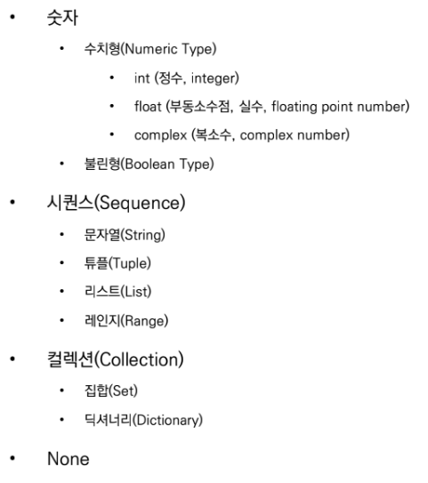
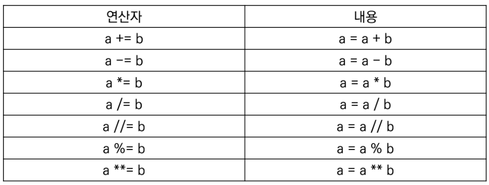
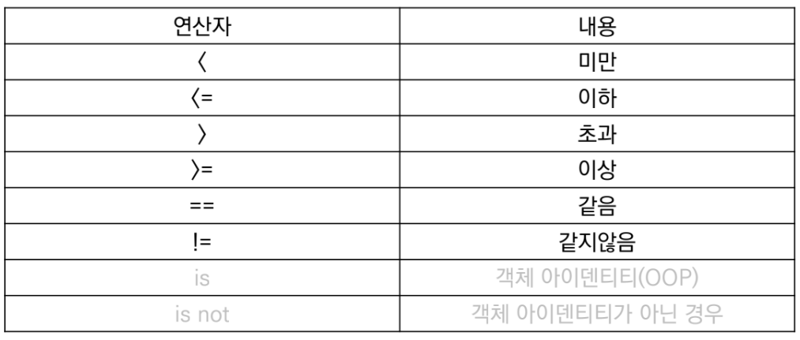
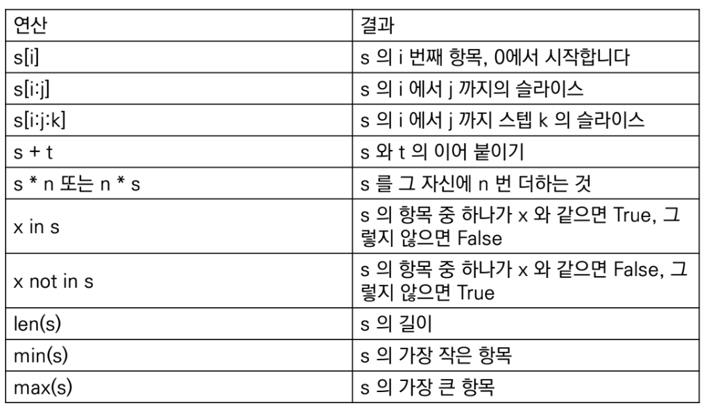

# 230102 학습내용 총정리

## Python 기초

- 컴퓨터 프로그래밍 언어

    - 컴퓨터(Computer)

        - `Caculation(조작)`
        - `Remember(저장)`

    - 프로그래밍(programming)
        - `명령어의 모음(집합)`

    - 언어
        - 자신의 `생각을 나타내고 전달하기` 위해 체계
        - `문법적`으로 맞는 말의 집합
        - 컴퓨터에게 명령하기 위한 약속

    - 선언적 지식(declarative knowledge)
        - 사실에 대한 내용

    - `명령적 지식(impertive knowledge)`
        - `How-to`

- 파이썬 특징

    - Easy to learn
    
    - Expressive Language
    
    - 크로스 플랫폼 언어
    
    - 인터프리터 언어(Interpreter)
    
    - 객체 지향 프로그래밍(Object Oriented Programming)
        - 파이썬은 객체지향 언어이며, 모든 것이 객체로 구현되어 있음
            - 객체(Object): 숫자, 문자, 클래스 등 값을 가지고 있는 모든 것

---

### 객체와 변수

- 객체(Object)

- 변수(Variable)

    - 동일 이름에 다른 객체를 언제든 할당할 수 있기 때문에 ‘변수’라고 불림

    - 변수는 할당 연산자(=)을 통해 값을 할당(assignment)

    - type()
        - 변수에 할당된 값의 타입

    - id()
        - 변수에 할당된 값(객체)의 고유한 아이덴티티(identity) 값이며, 메모리주소
    
    - 변수 할당
        - 값은 값을 동시에 할당할 수 있음
        - 다른 값을 동시에 할당할 수 있음(multiple assignment)

- 식별자(Identifiers)

    - 파이썬 객체(변수, 함수, 모듈, 클래스 등)를 식별하는데 사용하는 이름(name)

    - 규칙
        - 식별자의 이름은 영문 알파벳, 언더스코어(_), 숫자로 구성
        - 첫 글자에 숫자가 올 수 없음
        - 길이제한이 없고, 대소문자를 구별
        - 내장함수나 모듈 등의 이름으로도 만들면 안됨

---

### 자료형(Data Type)

- 자료형 분류

---

### 수치형(Numberic Type)

- 정수(Int)

    - 모든 정수의 타입은 int
       
    - 매우 큰 수를 나타낼 때 오버플로우가 발생하지 않음

        - 오버플로우(overflow): 데이터 타입별로 사용할 수 있는 메모리의 크기를 넘어서는 상황

- 실수(Float)

    - 정수가 아닌 모든 실수는 float 타입

    - 부동소수점

        - 실수를 컴퓨터가 표현하는 방법 - 2진수(비트)로 숫자를 표현

        - 이 과정에서 floating point rounding error가 발생하며, 예기치 못한 결과가 발생

    - Floating point ronding error

        - 부동소수점에서 실수 연산 과정에서 발생 가능

            - 값 비교하는 과정에서 정수가 아닌 실수인 경우 주의할 것
            - 매우 작은 수보다 작은지를 확인하거나 math 모듈 활용

- 복소수(Complex)

    - 실수부와 허수부로 구성된 복소수는 모두 complex 타입
        - 허수부를 j로 표현

---

### 불린형(Boolean Type)

- 불린(Boolean)

    - True/False 값을 가진 타입은 bool
        - True는 1, False는 0에 해당함
    - 비교/논리 연산을 수행함에 있어서 활용됨
    - 다음은 모두 False로 변환
        - 0, 0.0, (), [], {}, “, None

---

### 연산자(Operator)

- 산술 연산자(Arithmetic Operator)

    - 기본적인 사칙연산 및 수식 계산
        
        |연산자|내용|
        |--:|--|
        |+|덧셈|
        |-|뺄셈|
        |*|곱셈|
        |%|나머지|
        |/|나머지|
        |//|몫|
        |**|거듭제곱|
    
- 복합 연산자(In-place Operator)

    - 연산과 할당이 함께 이뤄짐
    

- 비교 연산자(Comparison Operator)

    - 값을 비교하며, True/False 값을 리턴함
    

- 논리 연산자(Logical Operator)

    - 논리식을 판단하여 참과 거짓을 반환함
    - and: 모두 참인 경우 참, 그렇지 않으면 거짓
    - or: 둘 중 하나만 참이라도 참, 그렇지 않으면 거짓
    - not: 참 거짓의 반대의 결과

---

### 컨테이너(Container)

- 여러 개의 값을 담을 수 있는 것(객체)

- 분류
    - 순서가 있는 데이터 (Ordered) vs 순서가 없는 데이터(Unordered)
    - 순서가 있다 ⇒ 정렬되어 있다
    - 시퀀스
        - 문자열(immutable): 문자들의 나열
        - 리스트(mutable): 변경 가능한 값들의 나열
        - 튜플(immutable): 변경 불가능한 값들의 나열
        - 레인지(immutable): 숫자의 나열

    - 컬렉션/비시퀀스
        - 세트(mutable): 유일한 값들의 모음
        - 딕셔너리(mutable): 키-값들의 모음

---

### 시퀀스형 컨테이너

- 시퀀스형 주요 공통 연산자

---

### 문자열(String Type)

- 모든 문자는 str 타입

- 문자열은 작은 따옴표(’)나 큰 따옴표를 활용하여 표기(”)
    
- 중첩따옴표(Nested Quotes)
    - 따옴표 안에 따옴표를 표현할 경우
        
- 삼중다옴표(Triple Quotes)
    - 작은 따옴표나 큰 따옴표를 삼중으로 사용
        - 따옴표 안에 따옴표를 넣을 때
        - 여러줄을 나눠 입력할 때 편리

- 인덱싱
    - 인덱스를 통해 특정 값에 접근할 수 있음
    - **`파이썬은 숫자를 0부터 센다`**
    - s[1] ⇒ 두 번째 글자

- 슬라이싱
    - s[이상:미만:간격]
    - s[2:5] ⇒ 2이상 5미만 범위 출력

- 기타
    - 결합(Concatenation)
    - 반복(Repetition)
    - 포함(Membership)

- Escape sequence
    - 문자열 내에서 특정 문자나 조작을 위해서 역슬래시(\)를 활용하여 구분
    
        연산자|내용
        --:|--
        \n|줄바꿈
        \t|탭
        \r|캐리지리턴
        \0|널(Null)
        \\|\
        \’|단일인용부호(’)
        \”|이중인용부호(”)

- 문자열 특징
    - Immutable: 변경 불가능함
    - Iterable: 반복 가능함

---

### 리스트(List)

- 변경 가능한 값들의 나열된 자료형
- 순서를 가지며, 서로 다른 타입의 요소를 가질 수 있음
- 변경 가능하며(mutable), 반복 가능함(iterable)
- 항상 대괄호 형태로 저의하며, 요소는 콤마로 구분

- 생성과 접근
    - 리스트는 대괄호([]) 혹은 list() 를 통해 생성
    - 순서가 있는 시퀀스로 인덱스를 통해 접근 가능
        - 값에 대한 접근은 list[i]

- 접근과 변경

- 값 추가/삭제
    - 추가: .append()를 활용하여 추가하고자 하는 값을 전달
    - 삭제: .pop()을 활용하여 삭제하고자 하는 인덱스를 전달

---

### None

- 파이썬 자료형 중 하나
- 파이썬에서는 값이 없음을 표현하기 위해 None 타입이 존재함
- 일반적으로 반환 값이 없는 함수에서 사용하기도 함

---

#### 사용자 입출력

- input([prompt])

    - 사용자로부터 값을 즉시 입력 받을 수 있는 내장함수
        - 대괄호 부분에 문자열을 넣으면 입력 시, 해당 문자열을 출력할 수 있음
    - 반환값은 항상 문자열의 형태로 반환

- print()

    - 모니터 화면에 결과물을 출력하기 위하여 활용
    - 변수의 경우 변수의 값을 출력하며, 객체별 표현 방식에 따라 출력하게 됨

---

#### 필수 단축키

- 파일 만들기: ctrl+n
- 파일 저장하기: ctrl+s
- 주석 처리하기: ctrl+/