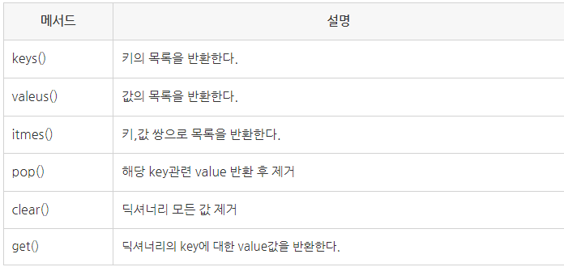

# 복습

- readline()
    - txt파일에서 한 줄만 읽기 때문에 반복문을 사용해야 끝까지 읽어올 수 있다.
    - 리스트(list)형태 X
- readlines()
    - txt파일의 내용들을 리스트(list)형태로 읽는다.
    - 개행도 함께 읽어서 데이터값 뒤에 ‘\n’이 붙어있다.

- strip()
    - 문자열에서 특정 문자를 제거할 수 있다.
    - 출력할 때 공백을 없애고 싶을 때
    - 글자 사이의 공백은 사라지지 않고, 글자의 앞, 위 빈공간의 공백만 사라지게 된다.

- 딕셔너리 메서드

    
