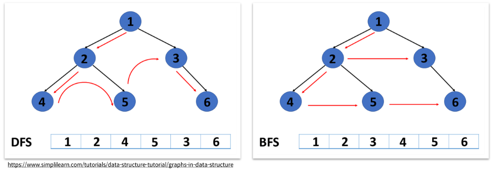
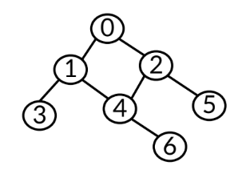
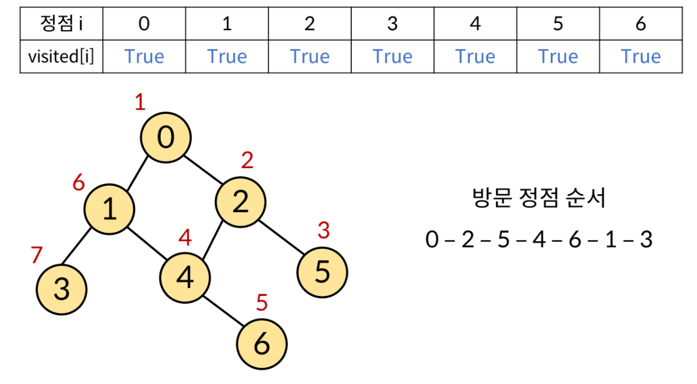

# 230206 Algorithm_11

## 깊이우선탐색(DFS)

### 그래프 탐색 알고리즘

- 시작 정점에서 간선을 타고 이동할 수 있는 모든 정점을 찾는 알고리즘
    - 깊이우선탐색, 너비우선탐색

- 스택 + 그래프 + 큐
    - 스택 + 그래프: 깊이우선탐색(Depth-First Search, DFS), 그래프의 깊이를 우선으로 탐색하기 위해 스택의 개념을 활용
    - 그래프 + 큐: 너비우선탐색(Breadth-First Search, BFS), 그래프의 너비를 우선으로 탐색하기 위해 큐의 개념을 활용



[참고](https://www.simplilearn.com/tutorials/data-structure-tutorial/graphs-in-data-structure)

---

### 깊이우선탐색(DFS)

- 시작 정점으로부터 `갈 수 있는 하위 정점까지 가장 깊게 탐색`하고, 더 이상 갈 곳이 없다면 마지막 갈림길로 돌아와서 다른 정점을 탐색하여 결국 모든 정점을 방문하는 순회 방법

- 특징
    - 모든 정점을 방문할 때 유리, 따라서 경우의 수, 순열과 조합 문제에서 많이 사용

    - 너비우선탐색(BFS)에 비해 코드 구현이 간단

    - 모든 정점을 방문할 필요가 없거나 최단 거리를 구하는 경우에는 너비우선탐색(BFS)가 유리

### DFS의 동작 과정

- 탐색을 진행할 그래프가 필요
    - 그래프는 인접 행렬 혹은 `인접 리스트` 방식으로 표현 가능

         
                    
```python
graph = [
	[1, 2],
	[0, 3, 4],
	[0, 4, 5],
	[1],
	[1, 2, 6],
	[2],
	[4]
]
```

- 각 정점을 방문했는지 여부를 판별할 방문 체크 리스트가 필요
```python
visited = [False] * n # n은 정점의 개수
```

정점 i|0|1|2|3|4|5|6|
:--:|:--:|:--:|:--:|:--:|:--:|:--:|:--:
visited[i]|False|False|False|False|False|False|False
- 인덱스는 각 정점의 번호
- 방문한 정점은 True, 방문하지 않은 정점은 False

- [DFS의 사이클]
    1. 현재 정점 방문처리
    2. 인접한 모든 정점 확인
    3. 방문하지 않은 인접 정점 이동

- 결과

    

---

### DFS 구현 방식

- 인접리스트 기준

- 반복문을 이용한 DFS
    - DFS는 직전에 방문한 정점으로 차례로 돌아가야 하므로, `후입선출(LIFO)구조의 스택`을 사용

        ```python
        graph = [
        [1, 2],
        [0, 3, 4],
        [0, 4, 5],
        [1],
        [1, 2, 6],
        [2],
        [4]
        ]

        visited = [False] * n # 방문 처리 리스트 만들기

        def dfs(start):
            stack = [start] # 돌아갈 곳을 기록
            visited[start] = True # 시작 정점 방문 처리

            while stack: # 스택이 빌 때까지(돌아갈 곳이 없을때까지) 반복
                cur = stack.pop() # 현재 방문 정점(후입선출)

                for adj in graph[cur]: # 인접한 모든 정점에 대해
                    if not visited[adj]: # 아직 방문하지 않았다면
                        visited[adj] = True # 방문 처리
                        stack.append(adj) # 스택에 넣기

        dfs(0) # 0번 정점에서 시작
        ```