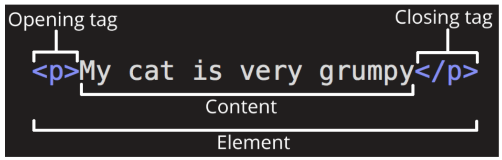
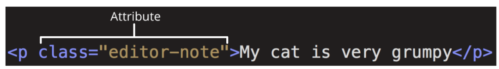

# 230222 WEB_1

## Web - Fundamentals of HTML and CSS

- World Wide Web
    - 인터넷으로 연결된 컴퓨터들이 정보를 공유하는 거대한 정보 공간
- Web site
    - 인터넷에서 여러 개의 Web page가 모인 것으로, 사용자들에게 정보나 서비스를 제공하는 공간
- Web page
    - HTML(Structure), CSS(Styling), JavaScript(Behavior) 등의 웹 기술을 이용하여 만들어진, 하나의 인터넷 문서
- Web page < Web site < World Wide Web

### Structuring the web

- HTML
    - HyperText Markup Language
    - 웹페이지의 의미와 구조를 정의하는 언어
- HTML Element
  
    - 하나의 요소는 여는 태그와 닫는 태그 그리고 그 안의 내용으로 구성(닫는 태그가 없는 태그 존재)
- HTML Attributes
  
    - 규칙
      - 요소 이름 다음에 바로 오는 속성은 요소 이름과 속성 사이에 공백이 있어야 함
      - 하나 이상의 속성들이 있는 경우엔 속성 사이에 공백으로 구분
      - 속성 값은 열고 닫는 따옴표로 감싸야 함
- HTML 문서의 구조
  ```HTML
  <!DOCTYPE html>
  <!-- 해당 문서가 html로 문서라는 것을 나타냄 -->
  <html lang="en">
  <!-- 전체 페이지의 콘텐츠를 포함(최상위태그) -->
  <head>
  <!-- HTML 문서에 관련된 설명, 설정 등(사용자에게 보이지 않음) -->
    <meta charset="UTF-8">
    <title>My page</title>
    <!-- 브라우저 탭 및 즐겨찾기 시 표시되는 제목으로 사용 -->
  </head>
  <body>
  <!-- 페이지에 표시되는 모든 콘텐츠 -->
    <p>This is my page</p>
  </body>
  </html>
  ```

### Text Structure
- HTML Text structure
  - 종류
    - Heading & Paragraphs: h1~6, p
    - Lists: ol, ul, li
      - Unordered
      - Ordered
    - Emphasis & Importance : em, strong
  
---
## Styling the web

- CSS
  - Cascading Style Sheet
  - 웹 페이지의 디자인과 레이아웃을 구성하는 언어

- CSS 적용 방법
  - 인라인(Inline) 스타일
    - 태그의 속성으로(스타일 속성)⇒ 잘 사용하지 않음
      ```HTML
      <!DOCTYPE html>
      <html lang="en">
      <head>
        ...
      </head>
      <body>
        <h1 style="color: blue; background-color: yellow;"> Hello World!</h1>
      </body>
      </html>
      ```
  - 내부(Internal) 스타일 시트
    - style태그 안에 작성
      ```HTML
      <!DOCTYPE html>
      <html lang="en">
      <head>
        <title>Document</title>
        <style>
          h1 {
            color: blue;
            background-color: yellow;
          }
        </style>
      </head>
      <body>
        <h1> Hello World!</h1>
      </body>
      </html>
      ```    
  - 외부(External) 스타일 시트
    - 별도 css 파일 생성 후 link 이용해서 불러옴
      ```HTML
      <!DOCTYPE html>
      <html lang="en">
      <head>
        ...
        <link rel="stylesheet" href="style.css">
      <title>Document</title>
      </head>
      <body>
        <h1> Hello World!</h1>
      </body>
      </html>
      ```
      ```CSS
      /* style.css */
      h1 {
        color: blue;
        background-color: yellow;
      }
      ```
### Select elements
- CSS Selectors
  - HTML 요소를 선택하여 스타일을 적용할 수 있도록 함
- 종류
  - 기본 선택자
    - 전체(*) 선택자
    - 요소(tag) 선택자
      - 지정한 모든 태그를 선택
    - 클래스(class) 선택자
      - 주어진 클래스 속성을 가진 모든 요소를 선택
      - ex) .index는 class=”index”를 가진 모든 요소를 선택
      - 한 개 이상의 곳에서 쓸 수 있다.
    - 아이디(id) 선택자
      - 주어진 아이디 속성을 가진 요소 선택
      - 문서에는 주어진 아이디를 가진 요소가 하나만 있어야 함(한 곳에서만 쓸 수 있다. )
      - ex) #index는 id=”index”를 가진 요소를 선택
    - 속성(attr) 선택자
  - 결합자(Combinators)
    - 자손 결합자(” “(space))
      - 첫 번째 요소의 자손 요소들 선택
    - 자식 결합자(>)
      - 첫 번째 요소의 직계 자식만 선택
- h1태그가 만약 2개인데 글 색상 지정 ⇒ 두 개 다 바뀜
    - 하나만 바꾸고 싶다 ⇒ 다양한 선택자 이용
- ! + tab / ! + enter ⇒ 기본 틀 생성
- 속성은 되도록 class만 사용하도록 권장

### Cascade & Specificity

- Cascade(계단식) & Specificity(우선순위)
  - 동일한 요소에 적용 가능한 같은 스타일을 두 가지 이상 작성 했을 때 어떤 규칙이 이기는지 결정하는 것
- Cascade(계단식)
  - 동일한 우선순위를 같는 규칙이 적용될 때 CSS에서 마지막에 나오는 규칙이 사용
    ```CSS
    h1 {
      color: red;
    }

    h1 {
      color: blue;
    }
    /* blue적용 */
    ```
- Specificity(우선순위)
  - 선택자 별로 정해진 우선순위 점수에 따라 점수가 높은 규칙이 사용
    ```CSS
    .make-red {
      color: red;
    }

    h1 {
      color: blue;
    }
    /* red적용 */
- 우선순위가 높은 순
  1. Importance
      - !important
      - Cascade 의 구조를 무시하고 모든 우선순위 점수 계산을 무효화하는 가장 높은 우선순위 => 사용하지 않는 것을 권장
  2. 우선 순위
      - 인라인 스타일 > id 선택자 > class 선택자 > 요소 선택자
  3. 소스 코드 순서

- 상속
  - 기본적으로 CSS는 상속을 통해 부모 요소의 속성을 자식에게 상속함 => 코드의 재사용성을 높임
  - 상속 가능 속성
    - Text 관련 요소(font, color, text-align), opacity, visibility 등
  - 상속 불가능 속성
    - Box model 관련 요소(width, height, margin, padding, border, box-sizing, display)
    - position 관련 요소(position, top/right/bottom/left, z-index) 등