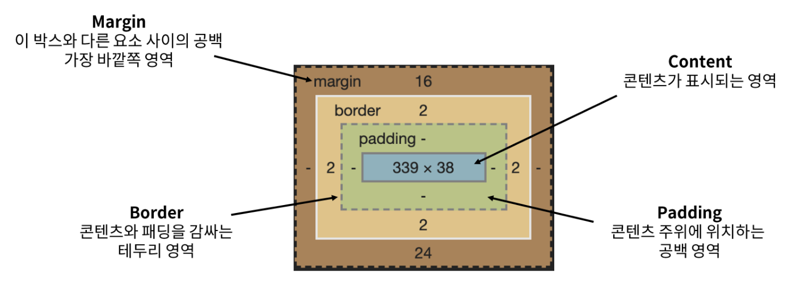
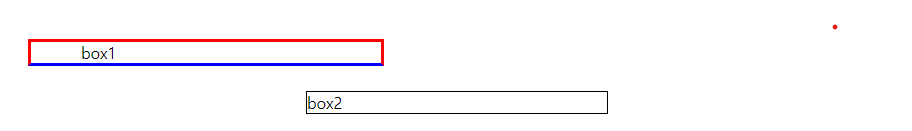
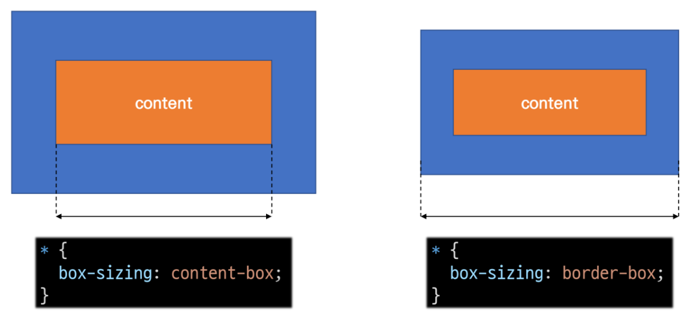
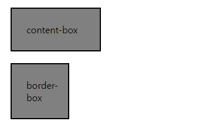
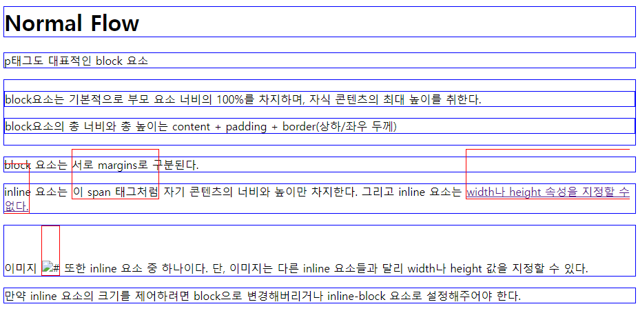

# 230223 WEB_2

## Web - The box model

- font-size
  - px, pt, small, rem, em, % …
  - em, rem: 부모 엘리먼트의 폰트사이즈의 상대 크기
    ```HTML
    <head>
      <style>
        .em {
          font-size: 2em;
          }
        .rem {
          font-size: 2rem;
          }
        ul {
          font-size: 10px;
          }
      </style>
    </head>

    <body>
      <ul>
        <li class="em">em</li>
        <li class="rem">rem</li>
      </ul>
    </body>
    ```
      - em: 20px ⇒ 부모에 상대적 ⇒ 2*10
      - rem: 32px ⇒ root(html)에 상대적 ⇒ html 기본 픽셀값: 16px ⇒ 16*2

---

### 구성 요소
- CSS Box Model
  - 모든 HTML 요소를 (사각형) 박스로 표현
  - 박스에 대한 크기, 여백, 테두리 등의 스타일을 지정하는 디자인 개념

- Box의 구성

  

  - top, bottom, left, right 존재
- 예시
  ```HTML
  <head>
    <style>
      .box1 {
        border-style: solid;
        border-width: 3px;
        border-color: red;
        border-bottom-color: blue;
        margin-top: 50px;
        margin-left: 30px;
        width: 300px;
        padding-left: 50px;  
      }

      .box2 {
        width: 300px;
        /* shorthand - 작성 순서 무관*/
        border: 1px solid black;
        margin: 25px auto;

      }
    </style>
  </head>
  <body>
    <div class="box1">box1</div>
    <div class="box2">box2</div>
  </body>
  ```
  - 결과

    

      - div: 구역 나누기 위해서 요소 하나를 묶어주는 태그
      - width: 컨텐츠 크기O, 박스 크기X
      - shorthand ⇒ 작성순서무관
      - 박스가 옆으로 가지 않고 아래로 가는 이유: 마진이 차있음
          - 블락박스는 박스가 차지하지 못한 공간을 마진으로 채움
      - box1너비: 356px ⇒ 사이즈 기준이 content-box 이기 때문 ⇒ border-box 기준하면 width 300px 줬을 때 border 포함 300px이 됨

- width & height 속성
  - 요소의 너비와 높이를 지정
  - 이때 지정되는 요소의 너비와 높이는 콘텐츠 영역을 대상으로 함

- box-sizing 속성
  - 요소와 너비와 높이를 계산하는 방법을 지정

    
  
  - 예시
      ```HTML
      <head>
        <style>
          .box {
                width: 100px;
                border: 2px solid black;
                background-color: gray;
                margin: 20px;
                padding: 25px
              }
          .content-box {
            box-sizing: content-box;
          }
          .border-box {
            box-sizing: border-box;
          }
        </style>
      </head>
      <body>
        <div class="box content-box">content-box</div>
        <div class="box border-box">border-box</div>
      </body>
      ```
      - 결과

        

### 박스 타입
- Block & Inline
  ```CSS
  .index {
    display: block;
  }

  .index {
    display: inline;
  }
  ```
- Normal flow
  - CSS를 적용하지 않았을 경우 Block 및 Inline 요소가 기본적으로 배치되는 방향

- 예시
  ```CSS
  a,
  span,
  img {
    border: 1px solid red;
    padding-top: 50px;
  }

  h1,
  p,
  div {
    border: 1px solid blue;
  }
  ```
  ```HTML
  <body>
    <h1>Normal Flow</h1>
    <p>p태그도 대표적인 block 요소</p>
    <div>
      <p>block요소는 기본적으로 부모 요소 너비의 100%를 차지하며, 자식 콘텐츠의 최대 높이를 취한다.</p>
      <p>block요소의 총 너비와 총 높이는 content + padding + border(상하/좌우 두께)</p>
    </div>
    <p>block 요소는 서로 margins로 구분된다.</p>
    <p>inline 요소는 <span>이 span 태그처럼</span> 자기 콘텐츠의 너비와 높이만 차지한다.
    그리고 inline 요소는 <a href="">width나 height 속성을 지정할 수 없다.</a>
    </p>
    <p>
      이미지  또한 inline 요소 중 하나이다.
      단, 이미지는 다른 inline 요소들과 달리 width나 height 값을 지정할 수 있다.
    </p>
    <p>
      만약 inline 요소의 크기를 제어하려면 block으로 변경해버리거나 
      inline-block 요소로 설정해주어야 한다.
    </p>
  </body>
  ```
- 결과

  

- block 타입 특징
  - 항상 새로운 행으로 나뉨
  - width와 height 속성을 사용하여 너비와 높이를 지정할 수 있음
  - 기본적으로 width 속성을 지정하지 않으면 박스는 inline 방향으로 사용 가능한 공간을 모두 차지함(너비를 사용가능한 공간의 100%로 채우는 것)
  - 대표적인 block타입 태그
    - h1~6, p, div

- inline 타입 특징
  - 새로운 행으로 나뉘지 않음
  - width와 height 속성을 사용할 수 없음
  - 수직 방향
    - padding, margins, borders가 적용되지만 다른 요소를 밀어낼 수는 없음
  - 수평 방향
    - padding, margins, borders가 적용되어 다른 요소를 밀어낼 수 있음
  - 대표적인 inline 타입 태그
    - a, img, span
      - span태그: 구역 구분

---

- margin auto: 창 넓이 늘려도 가운데 정렬 유지
- margin-left: auto; : 우측정렬, 오른쪽의 마진 영역을 왼쪽으로 모두 보낸다.
- margin-left: auto;, margin-right: auto; ⇒ 가운데 정렬
- center ⇒ 가운데 정렬
  - 정렬은 다양한 방법으로 가능

- shorthand 속성 - border
  - border-width, border-style, border-color를 한 번에 설정하기 위한 속성
    ```CSS
    border: 1px solid black;
    ```

- shorthand 속성 - margin & padding
  - 4방향의 속성을 각각 지정하지 않고 한번에 지정할 수 있는 속성
    ```CSS
    /* 4개 - 상우하좌 */
    margin: 10px 20px 30px 40px;
    padding: 10px 20px 30px 40px;
    /* 3개 - 상/좌우/하 */
    margin: 10px 20px 30px;
    padding: 10px 20px 30px;
    /* 2개 - 상하/좌우 */
    margin: 10px 20px;
    padding: 10px 20px;
    /* 1개 - 공통 */
    margin: 10px;
    padding: 10px;
    ```

- display: inline-block
  - 요소가 줄 바꿈 되는 것을 원하지 않으면서(inline) 너비와 높이를 적용하고 싶은 경우(block)에 사용
  - block 요소의 특징을 가짐
    - 너비 및 높이 속성이 준수
    - 패딩, 여백 및 테두리로 인해 다른 요소가 상자에서 밀려남

- Margin collapsing(마진 상쇄)
  - 두 block 타입 요소의 martin top 과 bottom이 만나 큰 margin으로 결합되는 현상
  - 각 요소에 대한 상/하 margin을 각각 설정하지 않고 한 요소에 대해서만 설정할 수 있음