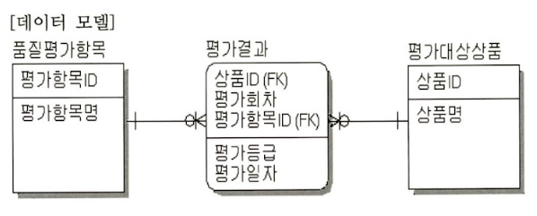

# 230224 DB_Test



문제: 데이터 모델에서 평가대상상품에 대한 품질평가 항목별 최종 평가결과를 추출하는 SQL 문장으로 옳은 것은?
(단 평가항목에 대한 평가등급이 기대수준에 미치지 못할 경우 해당 평가항목에 대해서만 재평가를 수행한다.)

```SQL 
SELECT B.상품ID, B.상품명, C.평가항목ID, C.평가항목명, A.평가회차, A.평가등급, A.평가일자
FROM 평가결과 A, 평가대상상품 B, 품질평가항목 C
WHERE A.상품ID = B.상품ID
  AND A.평가항목ID = C.평가항목ID
  AND A.평가회차 = (SELECT MAX(X.평가회차)
                    FROM 평가결과 X
                    WHERE X.상품ID = B.상품ID
                    AND X.평가항목ID = C.평가항목ID);
```                    