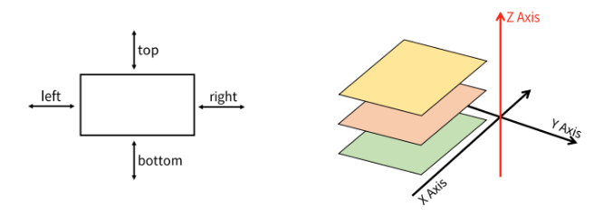
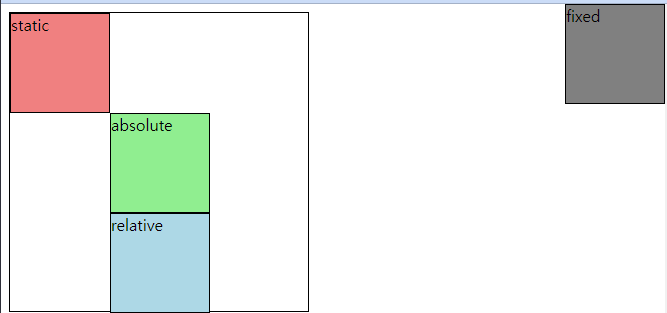
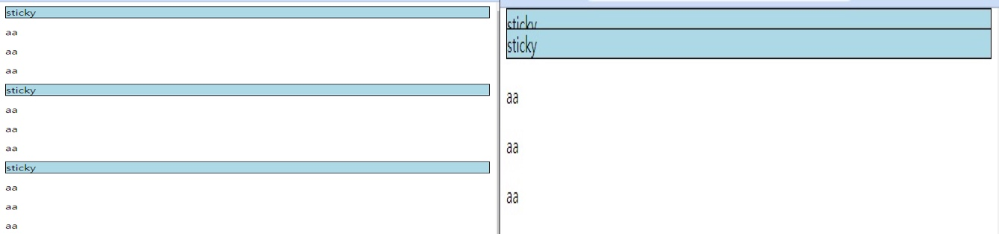
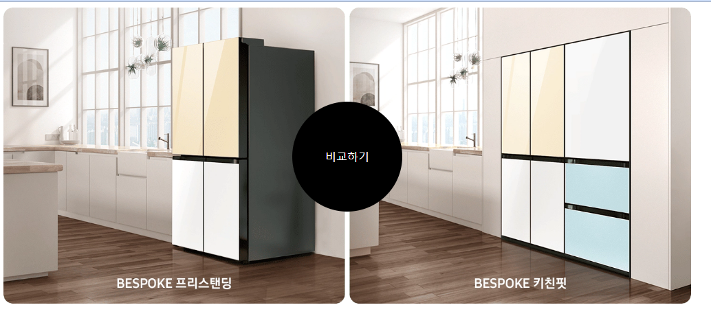
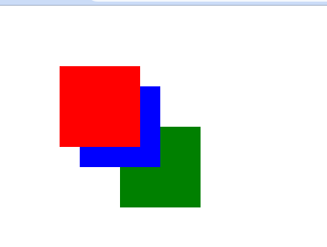

# 230227 WEB_3

## Web - Positioning for CSS layout

- CSS Layout
  - 각 요소의 위치와 크기를 조정하여 웹 페이지의 디자인을 결정하는 것
    - Display, `Position`, Floats, Flexbox

### 포지션
- CSS Position
  - Normal Flow에서 요소를 끄집어내서 다른 위치로 배치하는 것
  - 다른 요소 위에 놓기, 화면 특정 위치에 고정시키기 등
- Normal Flow
  - CSS를 적용하지 않았을 겨웅 웹페이지 요소가 기본적으로 배치되는 방향
- Position 이동 방향

  

- Position 유형
  - static(기본)
  - relative(상대위치)
  - absolute(절대)
  - fixed(고정)
  - sticky(끈끈이)

- 실습1
  ```CSS
  * {
      box-sizing: border-box;
    }

  body {
    height: 1500px;
	  }

  .box {
    width: 100px;
    height: 100px;
    border: 1px solid black;
	  }

  .container {
    width: 300px;
    height: 300px;
    border: 1px solid black;
    position: relative;
	  }

  .static {
    position: static;
    background-color: lightcoral;
	  }

  .absolute {
    position: absolute;
    background-color: lightgreen;
    left: 100px;
	  }

  .relative {
    position: relative;
    background-color: lightblue;
    left: 100px;
    top: 100px;
	  }

  .fixed {
    position: fixed;
    background-color: grey;
    right: 0;
    top: 0;
	  }
  ```
  ```HTML
  <div class="container">
    <div class="box static">static</div>
    <div class="box absolute">absolute</div>
    <div class="box relative">relative</div>
    <div class="box fixed">fixed</div>
  </div>
  ```
    - 결과

      

      - relative는 원래 static일 때의위치 기준으로 움직임
      - absolute ⇒ layout이 다 깨져버림

- 실습2
  ```CSS
  body {
    height: 1500px;
    }

  .sticky {
    position: sticky;
    background-color: lightblue;
    border: 1px solid black;
    top: 0;
    }
  ```
  ```HTML
  <div>
    <div class="sticky">sticky</div>
    <div>
      <p>aa</p>
      <p>aa</p>
      <p>aa</p>
    </div>
    <div class="sticky">sticky</div>
    <div>
      <p>aa</p>
      <p>aa</p>
      <p>aa</p>
    </div>
    <div class="sticky">sticky</div>
    <div>
      <p>aa</p>
      <p>aa</p>
      <p>aa</p>
    </div>
  </div>
  ```
    - 결과

      

- Position 유형별 특징
  - static
    - 기본값
    - 요소를 Normal Flow에 따라 배치
  - relative
    - 요소를 Normal Flow에 따라 배치
    - 자기 자신을 기준으로 이동
    - 요소가 차지하는 공간은 static일 때와 같음
  - absolute
    - 요소를 Normal Flow에서 제거
    - 가장 가까운 relative 부모 요소를 기준으로 이동
    - 문서에서 요소가 차지하는 공간이 없어짐
  - fixed
    - 요소를 Normal Flow에서 제거
    - 현재 화면영역(viewport)을 기준으로 이동
    - 문서에서 요소가 차지하는 공간이 없어짐
  - sticky
    - 요소를 Normal Flow에 따라 배치
    - 가장 가까운 block 부모 요소를 기준으로 이동
    - 요소가 특정 임계점(ex.viewport의 상단으로부터 10px)에 스크롤될 때 그 위치에서 고정됨(fixed)
    - 만약 다음 sticky 요소가 나오면 다음 sticky 요소의 자리를 대체
        - 이전 sticky 요소가 고정되어 있던 위치와 다음 sticky 요소가 고정되어야 할 위치가 겹치게 되기 때문

- absolute 실습
  ```CSS
  * {
  box-sizing: border-box;
    }

  .container {
    position: relative;
    width: 1000px;
    }

  .img {
    width: 100%;
    }

  .link {
    background-color: black;
    color: white;
    width: 10rem;
    height: 10rem;
    text-align: center;
    line-height: 10rem;
    border-radius: 50%;
    text-decoration: none;
    }

  .link-position {
    position: absolute;
    left: 50%;
    top: 50%;
    transform: translate(-50%, -50%);
    }
  ```
  ```HTML
  <div class="container">
    
    <a href="#" class="link link-position">비교하기</a>
  </div>
  ```
    - 결과

      

- z-index
  - 요소가 겹쳤을 때 어떤 요소 순으로 위에 나타낼 지 결정
    - z축 (스크린 표면으로부터 사용자 얼굴 쪽으로 향하는 라인) 기준 정렬
  
  - 실습
    ```CSS
    .box {
      width: 100px;
      height: 100px;
      position: absolute;
      }

    .red {
      background-color: red;
      top: 75px;
      left: 75px;
      z-index: 3;
      }

    .blue {
      background-color: blue;
      top: 100px;
      left: 100px;
      }

    .green {
      background-color: green;
      top: 150px;
      left: 150px;
      z-index: -1;
      }
    ```
    ```HTML
    <div class="container">
      <div class="box red"></div>
      <div class="box blue"></div>
      <div class="box green"></div>
    </div>
    ```
      - 결과

        

- z-index 특징
  - 정수 값을 사용해 Z축 순서를 지정
  - 더 큰 값을 가진 요소가 작은 값의 요소를 덮음