# 230228 WEB_4

## Web - Floating for CSS layout

### CSS Float
- 요소를 띄워서 텍스트 및 인라인 요소가 그 주위를 감싸도록 하는 배치
  - 왼쪽 혹은 오른쪽으로 띄워 Normal Flow에서 벗어남

- 실습
  ```CSS
  .box {
  width: 10rem;
  height: 10rem;
  border: 1px solid black;
  background-color: lightcoral;
  margin: 1rem;
  }

  .float-left {
    float: left;
  }

  .float-right {
    float: right;
  }
  ```
  ```HTML
  <div>
    <div class="box float-left">float left</div>
    <p>...</p>
    <div class="box float-right">float right</div>
    <p>...</p>
  </div>
  ```
    - 결과

      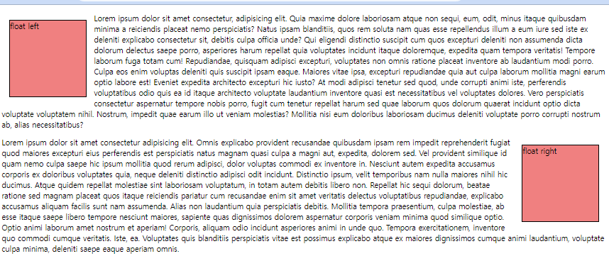

---

## Web - Flexible box for CSS layout

- CSS Flexbox
  - 요소를 행과 열 형태로 배치하는 1차원 레이아웃 방식
    - 요소 간 ‘공간 배열’과 ‘정렬’

  - 기본 사항

    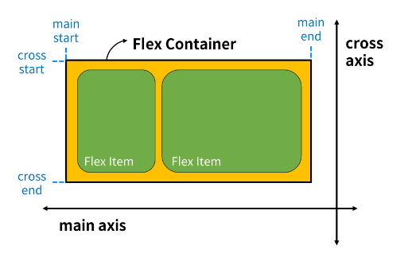

    - main axis(주축)
      - flex item들이 배치되는 기본 축

    - cross axis(교차축)
      - main axis에 수직인 축

    - Flex Container
      - display: flex; 혹은 display: inline-flex;가 설정된 부모 요소
      - 이 컨테이너의 1차 자식 요소들이 Flex Item이 됨

    - Flex Item
      - Flex Container 내부에 레이아웃 되는 항목

### Flexbox 레이아웃 구성

- Flexbox 속성
  - Flex Container 관련 속성
    - display, flex-direction, flex-wrap, justify-content, align-items, align-content
  - Flex Item 관련 속성
    - align-self, flex-grow, flex-shrink, flex-basis, order
- Flex Container 지정
  - flex item은 행으로 나열
  - flex item은 교차축의 크기를 채우기 위해 늘어남
    ```CSS
    .container {
      height: 500px;
      border: 1px solid black;
      display: flex;
	  }
    ```

      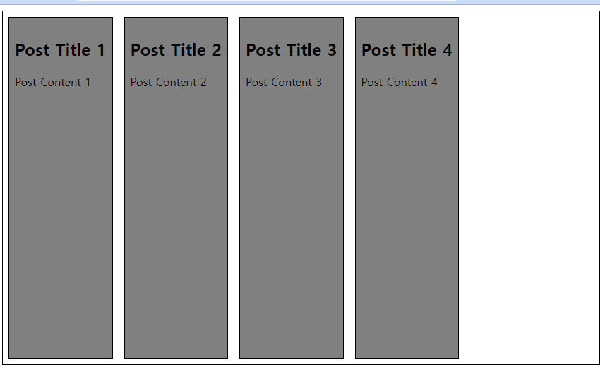

- flex-direction 지정
  - flex item이 나열되는 방향을 지정
  - row가 기본
  - column으로 지정할 경우 주 축이 변경됨
  - -reverse로 지정하면 시작 선과 끝 선이 서로 바뀜
    ```CSS
    .container {
      height: 500px;
      border: 1px solid black;
      display: flex;
			flex-direction: column;
	  }
    ```

      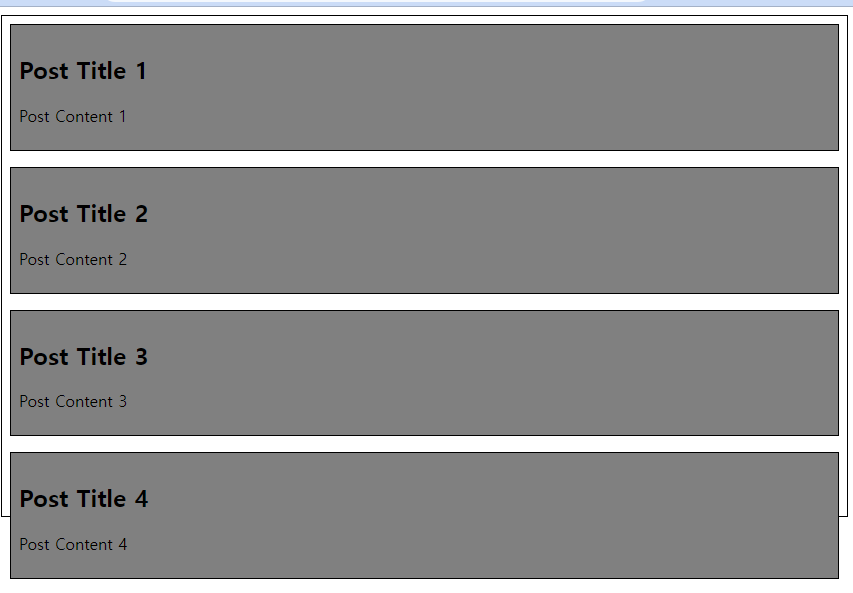

- flex-wrap
  - flex item 목록이 flex container의 하나의 행에 들어가지 않을 경우 다른 행에 배치할지 여부 설정
  - 화면 너비를 줄여서 확인
    ```CSS
    .container {
      height: 500px;
      border: 1px solid black;
      display: flex;
      flex-direction: row;
      
      /* flex-wrap: nowrap; */
      flex-wrap: wrap;
	  }
    ```

      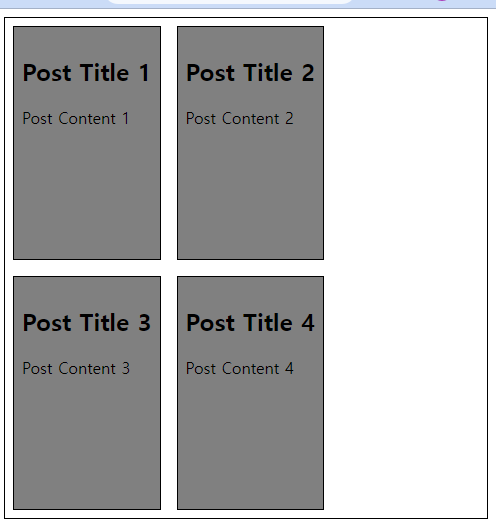

- justify-content
  - 주 축을 따라 flex item과 주위에 공간을 분배
    ```CSS
    .container {
          height: 500px;
          border: 1px solid black;
          display: flex;
          flex-direction: row;
          
          /* 주축 정렬 */
          justify-content: center;
          /* justify-content: flex-end; */
          /* justify-content: flex-start; */
      }
    ```

      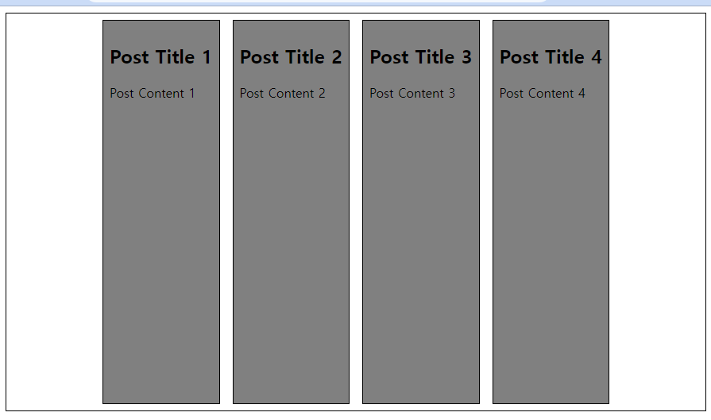

- align-content
  - 교차 축을 따라 flex item과 주위에 공간을 분배
  - flex-wrap이 wrap 또는 wrap-reverse로 설정된 여러 행에만 적용됨
  - 한 줄 짜리 행에는 (flex-wrap이 nowrap으로 설정된 경우) 효과 없음
    ```CSS
    .container {
          height: 500px;
          border: 1px solid black;
          display: flex;
          flex-direction: row;
          flex-wrap: wrap;
          /* 교차축 정렬 */
          /* align-content: flex-start; */
          align-content: center;
          /* align-content: flex-end; */
      }
    ```

      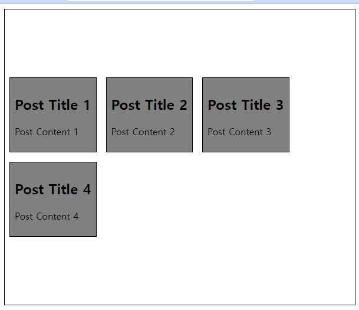

- align-items
  - 교차 축을 따라 flex item 행을 정렬
    ```CSS
    .container {
          height: 500px;
          border: 1px solid black;
          display: flex;
          flex-direction: row;

          align-items: center;
          /* align-items: flex-end; */
          /* align-items: flex-start; */
      }
    ```

      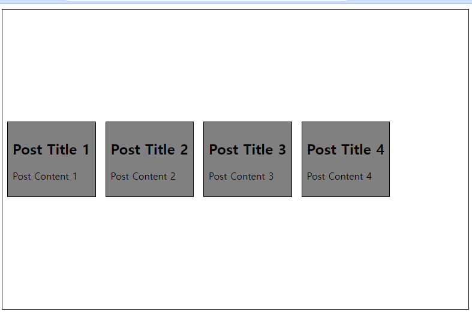

- align-self
  - 교차 축을 따라 개별 flex item을 정렬
    ```CSS
    .container {
          height: 500px;
          border: 1px solid black;
          display: flex;
          flex-direction: row;
      }

    .item1 {
          align-self: center;
      }

    .item2 {
          align-self: flex-end;
      }
    ```

      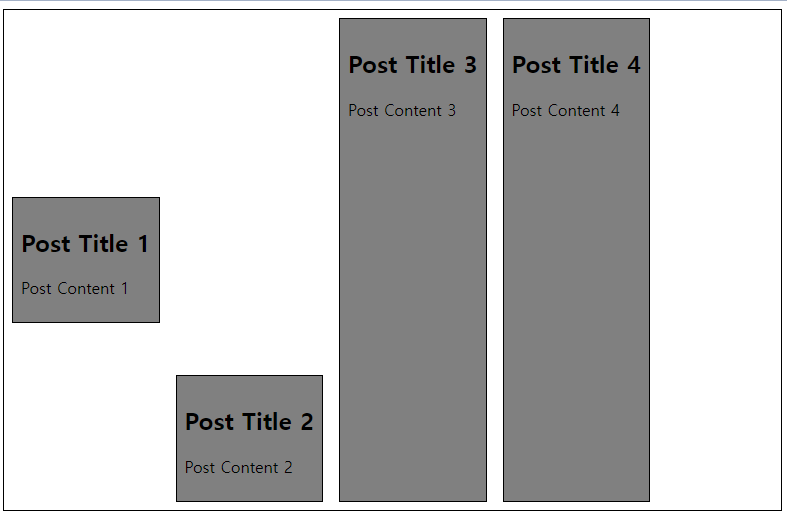

- 목적에 따른 분류
  - 배치 설정
    - flex-direction (주축)
    - flex-wrap (개행)
  - 공간 분배 (여러 행)
    - justify-content
    - align-content
  - 정렬
    - align-items (행 1)
    - align-self (요소 1)

- 속성명
  - justify (주축) align (교차 축)
  - 주축과 교차 축이 축의 방향에 따라 달라짐

- flex-grow
  - 남는 행 여백을 비율에 따라 각 flex item에 분배
  - flex-grow의 반대는 flex-shrink
    - 넘치는 너비를 분배해서 줄임

    ```CSS
    .container {
      width: 100%;
      display: flex;
    }

    .item {
      height: 100px;
      color: white;
      font-size: 3rem;
    }

    .item-1 {
      background-color: red;
      flex-grow: 1;
    }

    .item-2 {
      background-color: green;
      flex-grow: 2;
    }

    .item-3 {
      background-color: blue;
      flex-grow: 3;
    }
    ```
    ```HTML
    <div class="container">
      <div class="item item-1">1</div>
      <div class="item item-2">2</div>
      <div class="item item-3">3</div>
    </div>
    ```

      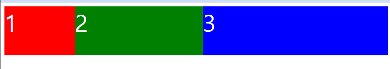

- flex basis
  - flex item의 초기 크기 값을 지정
  - flex-basis와 width 값을 동시에 적용한 경우 flex-basis가 우선
    ```CSS
    .container {
      width: 100%;
      display: flex;
      }

    .item {
      height: 100px;
      color: white;
      font-size: 3rem;
    }

    .item-1 {
    background-color: red;
    flex-basis: 300px;
      }

    .item-2 {
      background-color: green;
      flex-basis: 600px;
      }

    .item-3 {
      background-color: blue;
      flex-basis: 300px;
      }
    ```
    ```HTML
    <div class="container">
      <div class="item item-1">1</div>
      <div class="item item-2">2</div>
      <div class="item item-3">3</div>
    </div>
    ```

      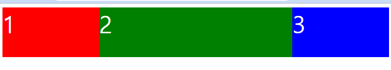 

### Flexbox 반응형 레이아웃

- flex-wrap을 사용해 반응형 레이아웃 작성 (+ flex-grow & flex-basis)

- 실습
  ```CSS
  .card {
  border: 1px solid black;
  width: 80%;
  display: flex;
  flex-wrap: wrap;
  }

  img {
    width: 100%;
    }

  .card-img {
    flex-basis: 700px;
    flex-grow: 1;
    }

  .content {
    flex-basis: 350px;
    border: 1px solid black;
    flex-grow: 1;
    }
  ```
  ```HTML
  <div class="card">
    
    <div class="content">
      <h2>Heading</h2>
      <p>...</p>
      <p>...</p>
    </div>
  </div>
  ```

    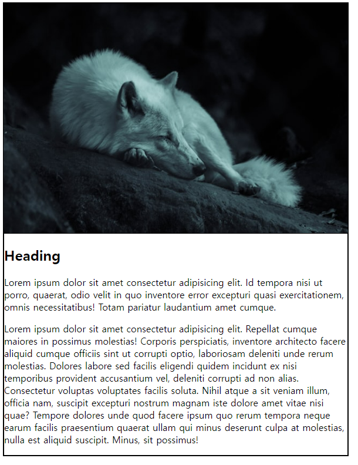 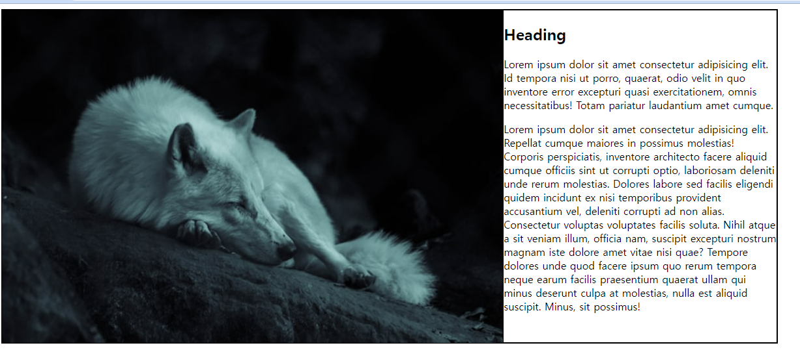