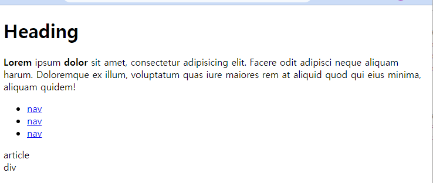
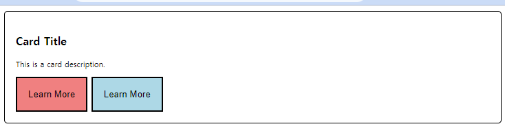
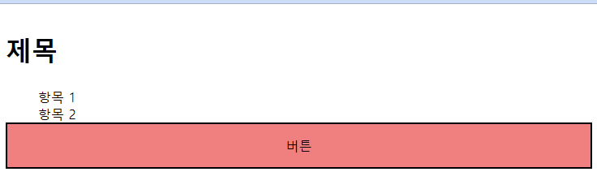

# 230302 WEB_5

## Web - Semantic Web

### **Semantics in HTML**

- HTML Semantic Element
  - 기본적인 모양과 기능 이외에 의미를 가지는 HTML 요소
  - 검색엔진 및 개발자가 웹 페이지의 콘텐츠를 이해하기 쉽게 만들어줌

- 페이지 구조화를 위한 대표적인 Semantic Element
  - header
  - nav
  - main
  - article
  - section
  - aside
  - footer

- 실습
  ```HTML
  <body>
    <header>
      <h1>Heading</h1>
    </header>

    <p> <b>Lorem</b> ipsum  <strong>dolor</strong> sit amet, consectetur adipisicing elit. Facere odit adipisci neque aliquam harum. Doloremque ex illum, voluptatum quas iure maiores rem at aliquid quod qui eius minima, aliquam quidem!</p>


    <nav>
      <ul>
        <li><a href="#">nav</a></li>
        <li><a href="#">nav</a></li>
        <li><a href="#">nav</a></li>
      </ul>
    </nav>

    <main>
      <article>
        <article>article</article>
        <div>div</div>
        <section></section>
      </article>
      <article></article>
      <aside></aside>
    </main>

    <footer></footer>
  </body>
  ```
    - 결과

      

      - strong : 강조의 의미를 가짐 / b : 의미가 없음
        - 스크린 리더기와 같은 기계에 읽혀질때, strong은 강조, b는 텍스트로 읽힘

### **Semantics in CSS**

- OOCSS
  - Object-Oriented CSS
    - 객체 지향적 접근법을 적용하여 CSS를 구성하는 방법론

- 실습
  ```CSS
  <style>
    /* 기본 카드 구조 */
    .card {
      border: 1px solid black;
      border-radius: 5px;
      padding: 1rem;
    }

    /* 카드 제목 */
    .card-title {
      font-size: 1rem;
      font-weight: bold;
    }

    /* 카드 내용 */
    .card-description {
      font-size: 0.7rem;
    }

    /* 기본 버튼 구조 */
    .btn {
      padding: 1rem;
      cursor: pointer;
    }

    .bg-red {
      background-color: lightcoral;
    }

    .bg-blue {
      background-color: lightblue;
    }
  </style>
  ```
  ```HTML
  <body>
    <div class="card">
      <p class="card-title">Card Title</p>
      <p class="card-description">This is a card description.</p>
      <button class="btn bg-red">Learn More</button>
      <button class="btn bg-blue">Learn More</button>
    </div>
  </body>
  ```
    - 결과

      

- BEM(Block Element Modifier)
  - 블록, 요소, 수정자를 사용해 클래스 이름을 구조화하는 방법론
  - 구성
    - Block
      - 문단 전체에 적용된 요소 또는 요소를 담고 있는 컨테이너
      - 재사용 가능한 독립적 블록, 가장 바깥쪽 상위요소
      - 재사용을 위해 margin 또는 padding을 적용하지 않음
    - Element
      - block이 포함하고 있는 한 조각
      - 블록을 구성하는 종속적인 하위요소
    - Modifier
      - block 또는 element의 속성

- 실습
  ```CSS
  <style>
    /* Block */
    .card {
      display: flex;
      flex-direction: column;
    }

    /* Element */
    .card__title {
      font-size: 2rem;
    }

    .card__list {
      margin: 0;
    }

    .card__button {
      font-size: 1rem;
      padding: 1rem;
      cursor: pointer;
    }

    /* Modifier */
    .card__list-item--none {
      list-style: none;
    }

    .card__button--red {
      background-color: lightcoral;
    }
  </style>
  ```
  ```HTML
  <body>
    <div class="card">
      <h2 class="card__title">제목</h2>
      <ul class="card__list">
        <li class="card__list-item--none">항목 1</li>
        <li class="card__list-item--none">항목 2</li>
      </ul>
      <button class="card__button card__button--red">버튼</button>
    </div>
  </body>
  ```
    - 결과

      

---
- 의미론적인 마크업의 이점
  - 검색 엔진이 해당 웹 사이트를 분석하기 쉽게 만들어 검색 순위에 영향을 줌
  - 시각 장애 사용자가 스크린 리더기로 웹 페이지를 사용할 때 추가적으로 도움 ⇒ 웹 접근성

- OOCSS & BEM의 목적
  - 재사용 가능한 모듈로 분리함으로써 유지보수성과 확장성을 향상
  - 개발자 간의 협력이 향상되어 공통 언어와 코드 이해를 확립

- emmet
  ```HTML
  div.wrapper>ul.list>li.item.item-$*5>a{link $}
  /* 작성 후 enter */

  <div class="wrapper">
    <ul class="list">
      <li class="item item-1"><a href="">link 1</a></li>
      <li class="item item-2"><a href="">link 2</a></li>
      <li class="item item-3"><a href="">link 3</a></li>
      <li class="item item-4"><a href="">link 4</a></li>
      <li class="item item-5"><a href="">link 5</a></li>
    </ul>
  </div>
  ```
    - 자동완성한 코드에서는 다음 입력으로 넘어갈 때 tab 으로 다음 입력 부분으로 이동 가능 