# 230306 WEB_6

## Web - Fundamentals of Bootstrap

- Bootstrap
  - 프론트엔드 라이브러리(Toolkit)
    - 반응형 웹 디자인 & CSS 및 JS 기반의 컴포넌트와 스타일 제공
  - 공식문서
    - [Bootstrap 공식문서](https://getbootstrap.com/)
  - 사용할 때마다 CDN 포함된 코드 블럭 사용
    ```HTML
    <!doctype html>
    <html lang="en">
      <head>
        <meta charset="utf-8">
        <meta name="viewport" content="width=device-width, initial-scale=1">
        <title>Bootstrap demo</title>
        <link href="https://cdn.jsdelivr.net/npm/bootstrap@5.3.0-alpha1/dist/css/bootstrap.min.css" rel="stylesheet" integrity="sha384-GLhlTQ8iRABdZLl6O3oVMWSktQOp6b7In1Zl3/Jr59b6EGGoI1aFkw7cmDA6j6gD" crossorigin="anonymous">
      </head>
      <body>
        <h1>Hello, world!</h1>
        <script src="https://cdn.jsdelivr.net/npm/bootstrap@5.3.0-alpha1/dist/js/bootstrap.bundle.min.js" integrity="sha384-w76AqPfDkMBDXo30jS1Sgez6pr3x5MlQ1ZAGC+nuZB+EYdgRZgiwxhTBTkF7CXvN" crossorigin="anonymous"></script>
      </body>
    </html>
    ```
- Bootstrap에서 클래스 이름으로 Spacing을 표현하는 방법
  
  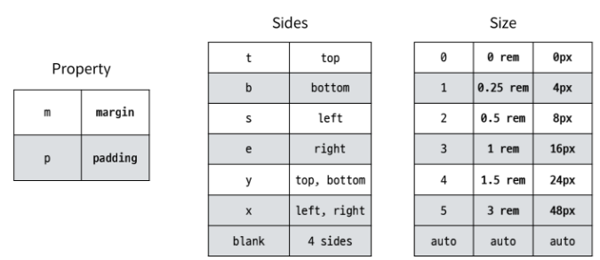
  
### Typography 및 Color

- Headings
  - HTML h1~h6 태그와 스타일을 일치 시키고 싶지만 관련 HTML 태그를 더 사용할 수 없는 경우
    ```HTML
    <h1>h1. Bootstrap heading</h1>
    <h2>h2. Bootstrap heading</h2>
    <h3>h3. Bootstrap heading</h3>
    <h4>h4. Bootstrap heading</h4>
    <h5>h5. Bootstrap heading</h5>
    <h6>h6. Bootstrap heading</h6>
    ```

      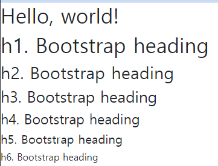

- Display headings
  - 기존 Heading보다 더 눈에 띄는 제목이 필요할 경우 (더 크고 약간 다른 스타일)      
    ```HTML
    <h1 class="display-1">Display 1</h1>
    <h1 class="display-2">Display 2</h1>
    <h1 class="display-3">Display 3</h1>
    <h1 class="display-4">Display 4</h1>
    <h1 class="display-5">Display 5</h1>
    <h1 class="display-6">Display 6</h1>
    ```

      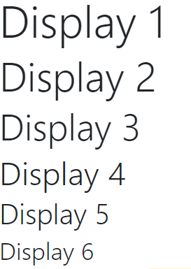

- Inline text elements
  - HTML inline 요소에 대한 스타일
    ```HTML
    <p>You can use the mark tag to <mark>highlight</mark> text.</p>
    <p><del>This line of text is meant to be treated as deleted text.</del></p>
    <p><s>This line of text is meant to be treated as no longer accurate.</s></p>
    <p><ins>This line of text is meant to be treated as an addition to the document.</ins></p>
    <p><u>This line of text will render as underlined.</u></p>
    <p><small>This line of text is meant to be treated as fine print.</small></p>
    <p><strong>This line rendered as bold text.</strong></p>
    <p><em>This line rendered as italicized text.</em></p>
    ```

      

- List
  - HTML list 요소에 대한 스타일
    ```HTML
    <ul class="list-unstyled">
      <li>This is a list.</li>
      <li>It appears completely unstyled.</li>
      <li>Structurally, it's still a list.</li>
      <li>However, this style only applies to immediate child elements.</li>
      <li>Nested lists:
        <ul>
          <li>are unaffected by this style</li>
          <li>will still show a bullet</li>
          <li>and have appropriate left margin</li>
        </ul>
      </li>
      <li>This may still come in handy in some situations.</li>
    </ul>
    ```

      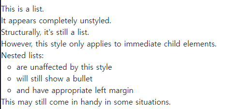

- Bootstrap Color system
  - Bootstrap이 지정하고 제공하는 색상 시스템

- Text colors
  ```HTML
  <p class="text-primary">.text-primary</p>
  <p class="text-primary-emphasis">.text-primary-emphasis</p>
  <p class="text-secondary">.text-secondary</p>
  <p class="text-secondary-emphasis">.text-secondary-emphasis</p>
  <p class="text-success">.text-success</p>
  <p class="text-success-emphasis">.text-success-emphasis</p>
  <p class="text-danger">.text-danger</p>
  <p class="text-danger-emphasis">.text-danger-emphasis</p>
  <p class="text-warning bg-dark">.text-warning</p>
  <p class="text-warning-emphasis">.text-warning-emphasis</p>
  <p class="text-info bg-dark">.text-info</p>
  <p class="text-info-emphasis">.text-info-emphasis</p>
  ```

    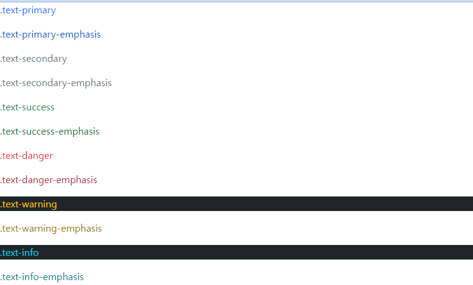

- Background colors
  ```HTML
  <div class="p-3 mb-2 bg-primary text-white">.bg-primary</div>
  <div class="p-3 mb-2 bg-primary-subtle text-emphasis-primary">.bg-primary-subtle</div>
  <div class="p-3 mb-2 bg-secondary text-white">.bg-secondary</div>
  <div class="p-3 mb-2 bg-secondary-subtle text-emphasis-secondary">.bg-secondary-subtle</div>
  <div class="p-3 mb-2 bg-success text-white">.bg-success</div>
  <div class="p-3 mb-2 bg-success-subtle text-emphasis-success">.bg-success-subtle</div>
  <div class="p-3 mb-2 bg-danger text-white">.bg-danger</div>
  <div class="p-3 mb-2 bg-danger-subtle text-emphasis-danger">.bg-danger-subtle</div>
  <div class="p-3 mb-2 bg-warning text-dark">.bg-warning</div>
  <div class="p-3 mb-2 bg-warning-subtle text-emphasis-warning">.bg-warning-subtle</div>
  <div class="p-3 mb-2 bg-info text-dark">.bg-info</div>
  <div class="p-3 mb-2 bg-info-subtle text-emphasis-info">.bg-info-subtle</div>
  ```

    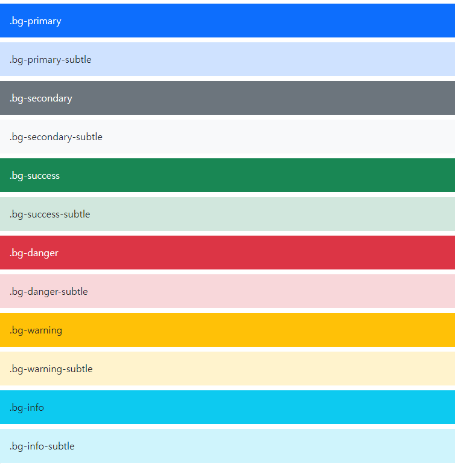

- Bootstrap 실습
  - 너비와 높이가 각각 200px인 정사각형 작성(너비와 높이를 제외한 값은 모두 bootstrap으로 작성)
    ```HTML
    <!DOCTYPE html>
    <html lang="en">
    <head>
      <meta charset="UTF-8">
      <meta http-equiv="X-UA-Compatible" content="IE=edge">
      <meta name="viewport" content="width=device-width, initial-scale=1.0">
      <title>Document</title>
      <link href="https://cdn.jsdelivr.net/npm/bootstrap@5.3.0-alpha1/dist/css/bootstrap.min.css" rel="stylesheet" integrity="sha384-GLhlTQ8iRABdZLl6O3oVMWSktQOp6b7In1Zl3/Jr59b6EGGoI1aFkw7cmDA6j6gD" crossorigin="anonymous">
      <style>
        div {
          width: 200px;
          height: 200px;
        }
      </style>
    </head>
    <body>
      <div class="border border-dark border-2 bg-info">
        box
      </div>
      <script src="https://cdn.jsdelivr.net/npm/bootstrap@5.3.0-alpha1/dist/js/bootstrap.bundle.min.js" integrity="sha384-w76AqPfDkMBDXo30jS1Sgez6pr3x5MlQ1ZAGC+nuZB+EYdgRZgiwxhTBTkF7CXvN" crossorigin="anonymous"></script>
    </body>
    </html>
    ```

      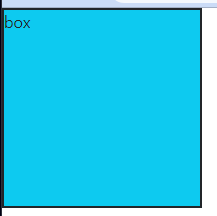

### Component

- Bootstrap Component
  - Bootstrap에서 제공하는 UI 관련 요소

- Alerts
  ```HTML
  <div class="alert alert-primary" role="alert">
  A simple primary alert—check it out!
  </div>
  <div class="alert alert-secondary" role="alert">
    A simple secondary alert—check it out!
  </div>
  <div class="alert alert-success" role="alert">
    A simple success alert—check it out!
  </div>
  <div class="alert alert-danger" role="alert">
    A simple danger alert—check it out!
  </div>
  <div class="alert alert-warning" role="alert">
    A simple warning alert—check it out!
  </div>
  <div class="alert alert-info" role="alert">
    A simple info alert—check it out!
  </div>
  <div class="alert alert-light" role="alert">
    A simple light alert—check it out!
  </div>
  <div class="alert alert-dark" role="alert">
    A simple dark alert—check it out!
  </div>
  ```

    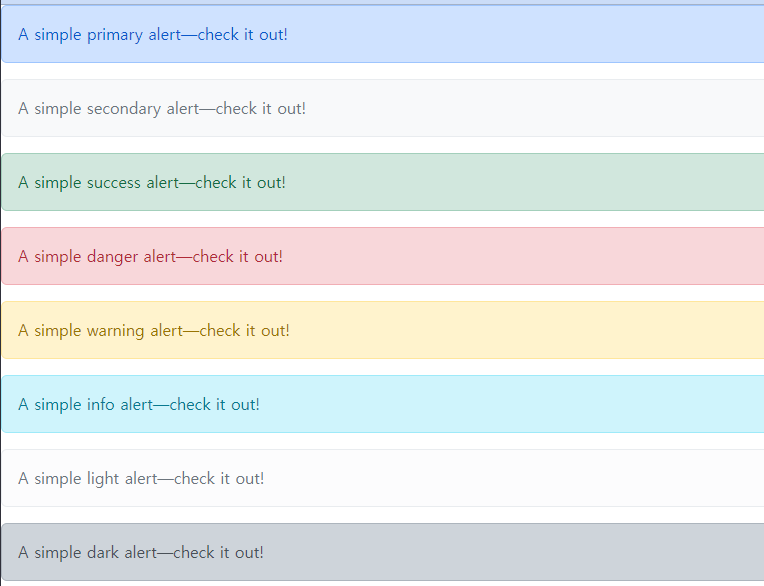  

- Badges
  ```HTML
  <span class="badge text-bg-primary">Primary</span>
  <span class="badge text-bg-secondary">Secondary</span>
  <span class="badge text-bg-success">Success</span>
  <span class="badge text-bg-danger">Danger</span>
  <span class="badge text-bg-warning">Warning</span>
  <span class="badge text-bg-info">Info</span>
  <span class="badge text-bg-light">Light</span>
  <span class="badge text-bg-dark">Dark</span>
  ```

    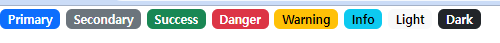  

- Buttons
  ```HTML
  <button type="button" class="btn btn-primary position-relative m-3">
    Inbox
    <span class="position-absolute top-0 start-100 translate-middle badge rounded-pill bg-danger">
      99+
      <span class="visually-hidden">unread messages</span>
    </span>
  </button>
  ```

    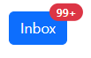  

- Cards
  ```HTML
  <div class="card m-5" style="width: 18rem;">
    
    <div class="card-body">
      <h5 class="card-title">Card title</h5>
      <p class="card-text">Some quick example text to build on the card title and make up the bulk of the card's content.</p>
      <a href="#" class="btn btn-primary">Go somewhere</a>
    </div>
  </div>
  ```

    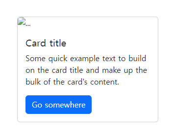  

- Navbar
  ```HTML
  <nav class="navbar navbar-expand-lg bg-body-tertiary">
    <div class="container-fluid">
      <a class="navbar-brand" href="#">Navbar</a>
      <button class="navbar-toggler" type="button" data-bs-toggle="collapse" data-bs-target="#navbarSupportedContent" aria-controls="navbarSupportedContent" aria-expanded="false" aria-label="Toggle navigation">
        <span class="navbar-toggler-icon"></span>
      </button>
      <div class="collapse navbar-collapse" id="navbarSupportedContent">
        <ul class="navbar-nav me-auto mb-2 mb-lg-0">
          <li class="nav-item">
            <a class="nav-link active" aria-current="page" href="#">Home</a>
          </li>
          <li class="nav-item">
            <a class="nav-link" href="#">Link</a>
          </li>
          <li class="nav-item dropdown">
            <a class="nav-link dropdown-toggle" href="#" role="button" data-bs-toggle="dropdown" aria-expanded="false">
              Dropdown
            </a>
            <ul class="dropdown-menu">
              <li><a class="dropdown-item" href="#">Action</a></li>
              <li><a class="dropdown-item" href="#">Another action</a></li>
              <li><hr class="dropdown-divider"></li>
              <li><a class="dropdown-item" href="#">Something else here</a></li>
            </ul>
          </li>
          <li class="nav-item">
            <a class="nav-link disabled">Disabled</a>
          </li>
        </ul>
        <form class="d-flex" role="search">
          <input class="form-control me-2" type="search" placeholder="Search" aria-label="Search">
          <button class="btn btn-outline-success" type="submit">Search</button>
        </form>
      </div>
    </div>
  </nav>
  ```

    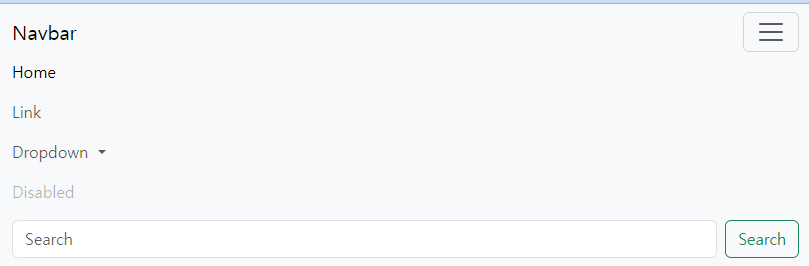  

- Accordion
  ```HTML
  <div class="accordion" id="accordionExample">
    <div class="accordion-item">
      <h2 class="accordion-header" id="headingOne">
        <button class="accordion-button" type="button" data-bs-toggle="collapse" data-bs-target="#collapseOne" aria-expanded="true" aria-controls="collapseOne">
          Accordion Item #1
        </button>
      </h2>
      <div id="collapseOne" class="accordion-collapse collapse show" aria-labelledby="headingOne" data-bs-parent="#accordionExample">
        <div class="accordion-body">
          <strong>This is the first item's accordion body.</strong> It is shown by default, until the collapse plugin adds the appropriate classes that we use to style each element. These classes control the overall appearance, as well as the showing and hiding via CSS transitions. You can modify any of this with custom CSS or overriding our default variables. It's also worth noting that just about any HTML can go within the <code>.accordion-body</code>, though the transition does limit overflow.
        </div>
      </div>
    </div>
    <div class="accordion-item">
      <h2 class="accordion-header" id="headingTwo">
        <button class="accordion-button collapsed" type="button" data-bs-toggle="collapse" data-bs-target="#collapseTwo" aria-expanded="false" aria-controls="collapseTwo">
          Accordion Item #2
        </button>
      </h2>
      <div id="collapseTwo" class="accordion-collapse collapse" aria-labelledby="headingTwo" data-bs-parent="#accordionExample">
        <div class="accordion-body">
          <strong>This is the second item's accordion body.</strong> It is hidden by default, until the collapse plugin adds the appropriate classes that we use to style each element. These classes control the overall appearance, as well as the showing and hiding via CSS transitions. You can modify any of this with custom CSS or overriding our default variables. It's also worth noting that just about any HTML can go within the <code>.accordion-body</code>, though the transition does limit overflow.
        </div>
      </div>
    </div>
    <div class="accordion-item">
      <h2 class="accordion-header" id="headingThree">
        <button class="accordion-button collapsed" type="button" data-bs-toggle="collapse" data-bs-target="#collapseThree" aria-expanded="false" aria-controls="collapseThree">
          Accordion Item #3
        </button>
      </h2>
      <div id="collapseThree" class="accordion-collapse collapse" aria-labelledby="headingThree" data-bs-parent="#accordionExample">
        <div class="accordion-body">
          <strong>This is the third item's accordion body.</strong> It is hidden by default, until the collapse plugin adds the appropriate classes that we use to style each element. These classes control the overall appearance, as well as the showing and hiding via CSS transitions. You can modify any of this with custom CSS or overriding our default variables. It's also worth noting that just about any HTML can go within the <code>.accordion-body</code>, though the transition does limit overflow.
        </div>
      </div>
    </div>
  </div>
  ```

    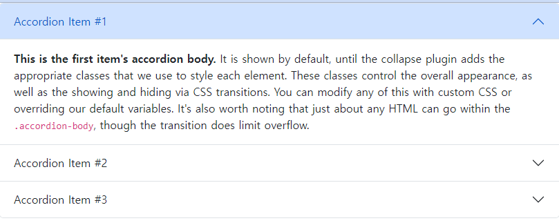  