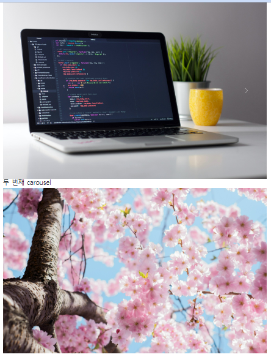
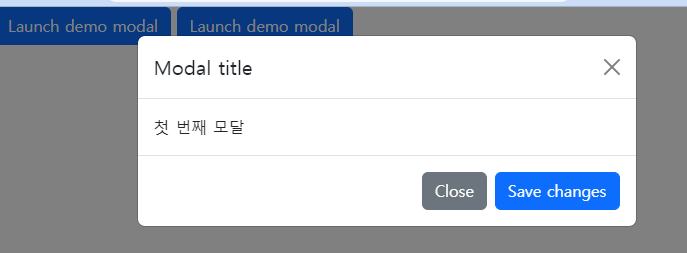
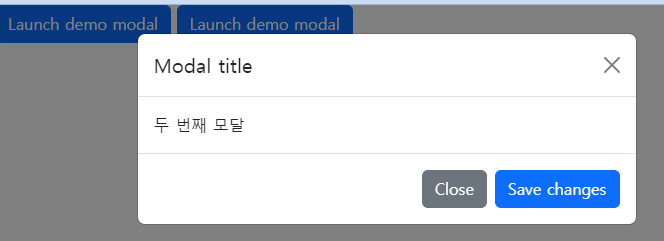
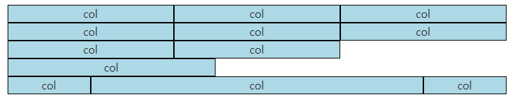
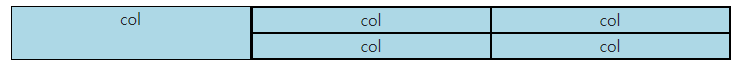
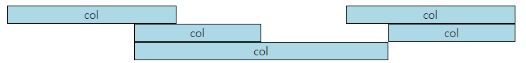
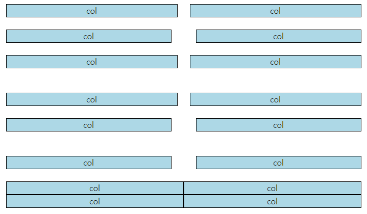

# 230307 WEB_7

### Carousel

```HTML
<div class="container">
  <div id="carouselExample-first" class="carousel slide">
    <div class="carousel-inner">
      <div class="carousel-item active">
        
      </div>
      <div class="carousel-item">
        
      </div>
      <div class="carousel-item">
        
      </div>
    </div>
    <button class="carousel-control-prev" type="button" data-bs-target="#carouselExample-first" data-bs-slide="prev">
      <span class="carousel-control-prev-icon" aria-hidden="true"></span>
      <span class="visually-hidden">Previous</span>
    </button>
    <button class="carousel-control-next" type="button" data-bs-target="#carouselExample-first" data-bs-slide="next">
      <span class="carousel-control-next-icon" aria-hidden="true"></span>
      <span class="visually-hidden">Next</span>
    </button>
  </div>
  <h2>두 번째 carousel</h2>
  <div id="carouselExample-second" class="carousel slide">
    <div class="carousel-inner">
      <div class="carousel-item active">
        
      </div>
      <div class="carousel-item">
        
      </div>
      <div class="carousel-item">
        
      </div>
    </div>
    <button class="carousel-control-prev" type="button" data-bs-target="#carouselExample-second" data-bs-slide="prev">
      <span class="carousel-control-prev-icon" aria-hidden="true"></span>
      <span class="visually-hidden">Previous</span>
    </button>
    <button class="carousel-control-next" type="button" data-bs-target="#carouselExample-second" data-bs-slide="next">
      <span class="carousel-control-next-icon" aria-hidden="true"></span>
      <span class="visually-hidden">Next</span>
    </button>
  </div>
</div>
```

  

  - 주의: id와 target을 일치시켜야 함. 같은 값으로 해주면 나머지 Carousel 작동 X

### Modal

```HTML
<!-- Button trigger modal -->
<button type="button" class="btn btn-primary" data-bs-toggle="modal" data-bs-target="#exampleModal-first">
  Launch demo modal
</button>

<!-- Button trigger modal -->
<button type="button" class="btn btn-primary" data-bs-toggle="modal" data-bs-target="#exampleModal-second">
  Launch demo modal
</button>

<!-- Modal -->
<div class="modal fade" id="exampleModal-first" tabindex="-1" aria-labelledby="exampleModalLabel" aria-hidden="true">
  <div class="modal-dialog">
    <div class="modal-content">
      <div class="modal-header">
        <h1 class="modal-title fs-5" id="exampleModalLabel">Modal title</h1>
        <button type="button" class="btn-close" data-bs-dismiss="modal" aria-label="Close"></button>
      </div>
      <div class="modal-body">
        첫 번째 모달
      </div>
      <div class="modal-footer">
        <button type="button" class="btn btn-secondary" data-bs-dismiss="modal">Close</button>
        <button type="button" class="btn btn-primary">Save changes</button>
      </div>
    </div>
  </div>
</div>

<!-- Modal -->
<div class="modal fade" id="exampleModal-second" tabindex="-1" aria-labelledby="exampleModalLabel" aria-hidden="true">
  <div class="modal-dialog">
    <div class="modal-content">
      <div class="modal-header">
        <h1 class="modal-title fs-5" id="exampleModalLabel">Modal title</h1>
        <button type="button" class="btn-close" data-bs-dismiss="modal" aria-label="Close"></button>
      </div>
      <div class="modal-body">
        두 번째 모달
      </div>
      <div class="modal-footer">
        <button type="button" class="btn btn-secondary" data-bs-dismiss="modal">Close</button>
        <button type="button" class="btn btn-primary">Save changes</button>
      </div>
    </div>
  </div>
</div>
```

  
  

  - 주의
    - id와 target 일치 시킬 것
    - modal 버튼과 modal 요소는 반드시 같이 다닐 필요가 없음
    - modal 코드가 다른 요소들에 중첩되어 있을 경우 검은 배경뒤로 감춰질 수 있디 때문에 다른 요소에 중첩되어 두지 않는다.
    - => body 태그가 닫히는 부분에 modal 요소를 모아두는 것이 일반적

---

## Web - Fundamentals of Bootstrap

- Bootstrap Grid system
  - 웹 페이지의 레이아웃을 조정하는 데 사용되는 12개의 컬럼으로 구성된 시스템
  - 반응형 디자인을 지원
  - 12: 적당히 크고 많은 약수를 가진 수

### Grid system 클래스와 기본 구조 

- 1개의 row안에 12칸의 column영역이 구성, 각 요소는 12칸 중 몇 개를 차지할 것인지 지정
- 실습 - 기본
  ```HTML
  <div class="container">
    <div class="row">
      <div class="box col">col</div>
      <div class="box col">col</div>
      <div class="box col">col</div>
    </div>
    <div class="row">
      <div class="box col-4">col</div>
      <div class="box col-4">col</div>
      <div class="box col-4">col</div>
    </div>
    <div class="row">
      <div class="box col-4">col</div>
      <div class="box col-4">col</div>
      <div class="box col-5">col</div>
    </div>
    <div class="row">
      <div class="box col-2">col</div>
      <div class="box col-8">col</div>
      <div class="box col-2">col</div>
    </div>
  </div>
  ```

    

- 실습 - 중첩
  ```HTML
  <div class="container">
    <div class="row">
      <div class="box col-4">col</div>
      <div class="box col-8">
        <div class="row">
          <div class="box col-6">col</div>
          <div class="box col-6">col</div>
          <div class="box col-6">col</div>
          <div class="box col-6">col</div>
        </div>
      </div>
    </div>
  </div>
  ```

    

- 실습 - Offset
  ```HTML
  <div class="container">
    <div class="row">
      <div class="box col-4">col</div>
      <div class="box col-4 offset-4">col</div>
    </div>
    <div class="row">
      <div class="box col-3 offset-3">col</div>
      <div class="box col-3 offset-3">col</div>
    </div>
    <div class="row">
      <div class="box col-6 offset-3">col</div>
    </div>
  </div>
  ```

    

- Gutters
  - Grid system에서 column 사이에 padding 영역

- 실습
  ```HTML
  <div class="container">
    <div class="row">
      <div class="col-6">
        <div class="box">col</div>
      </div>
      <div class="col-6">
        <div class="box">col</div>
      </div>
    </div>
  </div>

  <br>

  <div class="container">
    <div class="row gx-5">
      <div class="col-6">
        <div class="box">col</div>
      </div>
      <div class="col-6">
        <div class="box">col</div>
      </div>
    </div>
  </div>

  <br>

  <div class="container">
    <div class="row gy-5">
      <div class="col-6">
        <div class="box">col</div>
      </div>
      <div class="col-6">
        <div class="box">col</div>
      </div>
      <div class="col-6">
        <div class="box">col</div>
      </div>
      <div class="col-6">
        <div class="box">col</div>
      </div>
    </div>
  </div>

  <br>

  <div class="container">
    <div class="row g-5">
      <div class="col-6">
        <div class="box">col</div>
      </div>
      <div class="col-6">
        <div class="box">col</div>
      </div>
      <div class="col-6">
        <div class="box">col</div>
      </div>
      <div class="col-6">
        <div class="box">col</div>
      </div>
    </div>
  </div>
  ```

    

    - gx-: 수평
    - gy-: 수직
    - g-: 수평수직