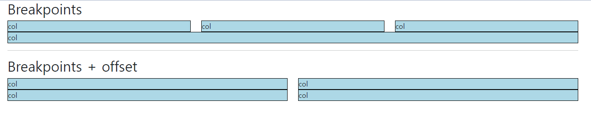
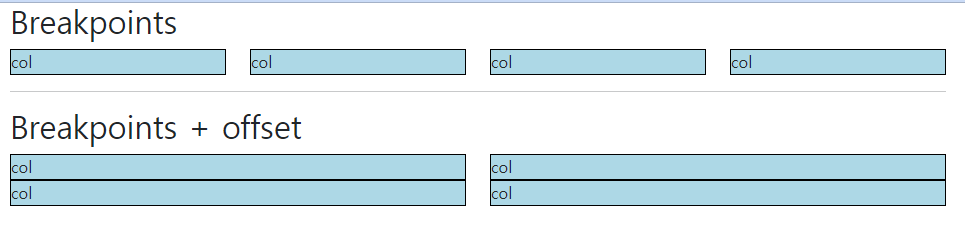
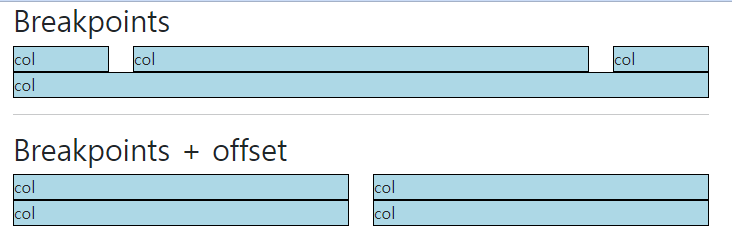
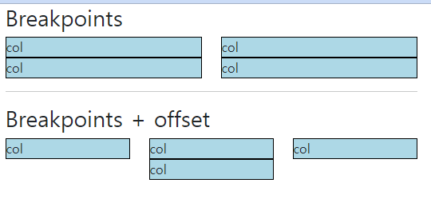
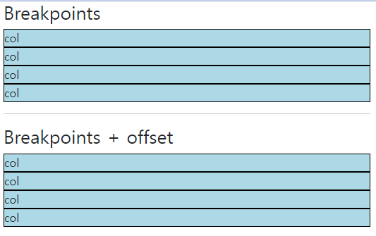

# 230308 WEB_8

## Web - Grid system for responsive web design

- Responsive Web Design
  - 디바이스 종류나 화면 크기에 상관없이, 어디에서든 일관된 레이아웃 및 사용자 경험을 제공하는 디자인 기술
  - Bootstrap grid system의 12개 column과 6개 breakpoints를 사용하여 반응형 웹 디자인을 구현

### Grid system Breakpoints

- Grid system breakpoints
  - 웹 페이지를 다양한 화면 크기에서 적절하게 배치하기 위한 분기점
  - 화면 너비에 따라 6개의 분기점 제공
    - xs, sm(576px), md(768px), lg(992px), xl(1200px), xxl(1400px)
  - 각 breakpoints 마다 설정된 최대 너비 값 “이상으로” 화면이 커지면 grid system 동작이 변경됨

- 실습
  ```HTML
  <div class="container">
    <h2>Breakpoints</h2>
    <div class="row">
      <div class="col-12 col-sm-6 col-md-2 col-lg-3 col-xl-4">
        <div class="box">col</div>
      </div>
      <div class="col-12 col-sm-6 col-md-8 col-lg-3 col-xl-4">
        <div class="box">col</div>
      </div>
      <div class="col-12 col-sm-6 col-md-2 col-lg-3 col-xl-4">
        <div class="box">col</div>
      </div>
      <div class="col-12 col-sm-6 col-md-12 col-lg-3 col-xl-12">
        <div class="box">col</div>
      </div>
    </div>  

  <hr>

    <h2>Breakpoints + offset</h2>
    <div class="row">
      <div class="col-12 col-sm-4 col-md-6">
        <div class="box">col</div>
      </div>
      <div class="col-12 col-sm-4 col-md-6">
        <div class="box">col</div>
      </div>
      <div class="col-12 col-sm-4 col-md-6">
        <div class="box">col</div>
      </div>
      <div class="col-12 col-sm-4 offset-sm-4 col-md-6 offset-md-0">
        <div class="box">col</div>
      </div>
    </div>
  </div>
  ```
  
    

    

    

    

    