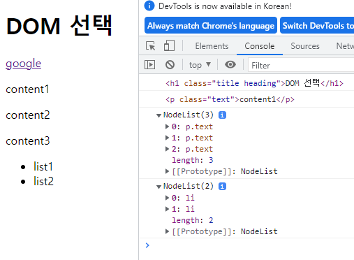
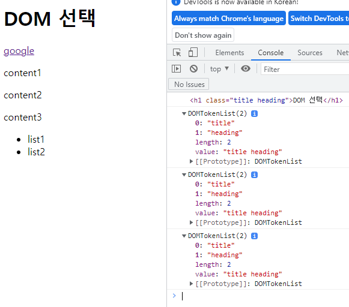
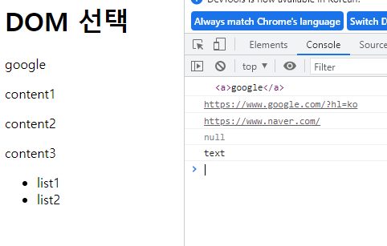
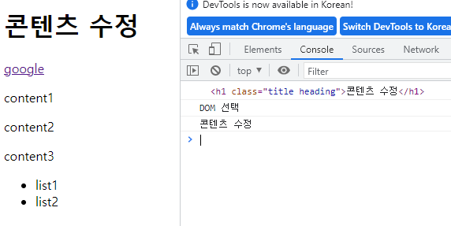

# 230313 JavaScript_1

## Web - JavaScript and DOM

### DOM 기본 개념
- DOM
  - 웹 페이지(Document)를 구조화된 객체로 제공하며 프로그래밍 언어가 웹 페이지를 사용할 수 있게 연결시킴

- 브라우저는 HTML 문서를 해석하여 DOM tree라는 객체의 트리로 구조화 함

- DOM에서 모든 요소, 속성, 텍스트는 하나의 객체이며 모두 document 객체의 자식

- 웹 페이지를 동적으로 만드는 것 = 웹 페이지를 조작(생성, 추가, 삭제)하는 것

- 'document’ object
  - 웹 페이지 객체
  - DOM tree의 진입점
  - 페이지를 구성하는 모든 객체 요소를 포함
  - [https://developer.mozilla.org/ko/docs/Web/API/Document](https://developer.mozilla.org/ko/docs/Web/API/Document)

### DOM Query (선택)
- 요소 하나 선택: document.querySelector()
  - 제공한 선택자와 일치하는 element 한 개 선택
  - 제공한 CSS selector를 만족하는 첫 번째 element 객체를 반환 (없다면 null반환)
- 요소 여러 개 선택: document.querySelectorAll()
  - 제공한 선택자와 일치하는 여러 element를 선택
  - 매칭 할 하나 이상의 셀렉터를 포함하는 유효한 CSS selector를 인자(문자열)로 받음
  - 제공한 CSS selector를 만족하는 NodeList를 반환
- DOM 선택 실습
  ```HTML
  <body>
    <h1 class="title heading">DOM 선택</h1>
    <a href="https://www.google.com/?hl=ko">google</a>
    <p class="text">content1</p>
    <p class="text">content2</p>
    <p class="text">content3</p>
    <ul>
      <li>list1</li>
      <li>list2</li>
    </ul>
    <script>
      // console.log('hello')
      // 클래스가 title인 요소 선택
      console.log(document.querySelector('.title'))
      console.log(document.querySelector('.text'))
      console.log(document.querySelectorAll('.text'))
      console.log(document.querySelectorAll('ul > li'))
      
    </script>
  </body>
  ```

    

### DOM Manipulation (조작)

- 클래스 속성 조작
  - ‘classList’ property
  - 요소의 클래스 목록을 DOMTokenList(유사 배열) 형태로 반환
    - add() 와 remove() 메서드를 사용해 지정한 클래스 값을 추가 혹은 제거
  - element.classList.add()
    - 지정한 클래스 값을 추가
  - element.classList.remove()
    - 지정한 클래스 값을 제거
  - 실습
    ```HTML
    <script>
      // 속성 조작
      // 클래스 속성 조작
      console.log(document.querySelector('h1'))
      const h1Tag = document.querySelector('h1')
      console.log(h1Tag.classList)

      h1Tag.classList.add('test')
      console.log(h1Tag.classList)

      h1Tag.classList.remove('test')
      console.log(h1Tag.classList)
    </script>
    ```

      

- 일반 속성 조작
  - 조회: Element.getAttribute()
    - 해당 요소에 지정된 값을 반환
  - 설정(수정): Element.setAttribute()
    - 지정된 요소의 속성 값을 설정
    - 속성이 이미 있으면 값이 업데이트 / 그렇지 않으면 지정된 이름과 값으로 새 속성이 추가
  - 삭제: Element.removeAttribute()
    - 요소에서 지정된 이름을 가진 속성 제거
  - 실습
    ```HTML
    <script>
      // 일반 속성 조작
      const aTag = document.querySelector('a')
      console.log(aTag)
      console.log(aTag.getAttribute('href'))

      aTag.setAttribute('href', 'https://www.naver.com/')
      console.log(aTag.getAttribute('href'))  

      aTag.removeAttribute('href')
      console.log(aTag.getAttribute('href'))

      const pTag = document.querySelector('.text')
      console.log(pTag.getAttribute('class'))

    </script>
    ```

      

- HTML 콘텐츠 조작
  - ‘textContent’ property
  - 요소의 텍스트 콘텐츠를 표현
  - 실습
    ```HTML
    <script>
      // h1 tag 선택
      const h1Tag = document.querySelector('.heading')
      console.log(h1Tag)
      console.log(h1Tag.textContent)
      
      h1Tag.textContent = '콘텐츠 수정'
      console.log(h1Tag.textContent)
    </script>
    ```

      

- DOM 요소 조작
  - 생성: .createElement()
  - 추가: .appendChild()
    - 이미 문서에 존재하는 요소를 다른 요소의 자식으로 삽입하는 경우 위치를 이동
  - 삭제: .removeChild()
  - 실습
    ```HTML
    <body>
      <div>

      </div>
      <script>
        // 1. 생성
        console.log(document.createElement('h1'))
        const h1Tag = document.createElement('h1')
        h1Tag.textContent = '제목'
        console.log(h1Tag)

        // 2. 추가
        const divTag = document.querySelector('div')
        divTag.appendChild(h1Tag)

        // 3. 삭제
        divTag.removeChild(h1Tag)

      </script>
    </body>
    ```

      

- style 조작
  - ‘style’ property
  - 해당 요소의 모든 스타일 속성 목록을 포함하는 속성
  - 실습
    ```HTML
    <body>
      <p>Heading</p>

      <script>
        const pTag = document.querySelector('p')

        pTag.style.color = 'red'

        pTag.style.fontSize = '3rem'

        console.log(pTag.style)
      </script>
    </body>
    ```

      