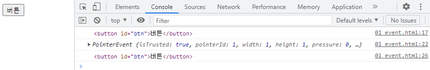
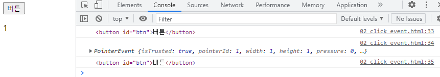
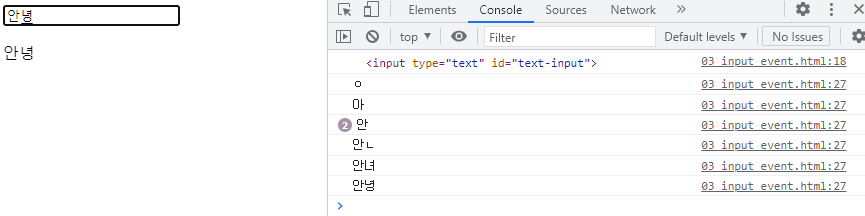
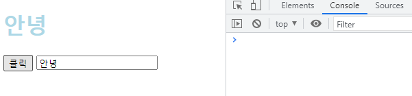
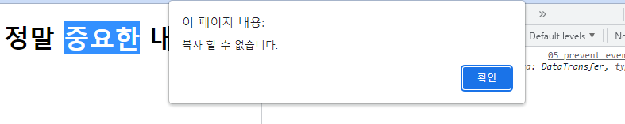
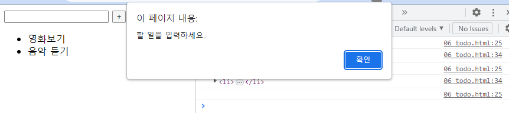
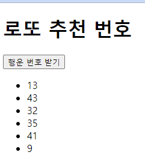

# 230316 JavaScript_6

## JS 07 - Controlling event

### 이벤트
- event handler(처리기)
  - 이벤트가 발생했을 때 실행되는 함수 (사용자의 행동에 어떻게 반응할지를 JS 코드로 표현한 것)
- .addEventListener()
  - 특정 이벤트를 DOM 요소가 수신할 때마다 콜백 함수를 호출
  - 구조
    ```js
    EventTarget.addEventListener(type, handler)
    ```
    - EventTarget: DOM 요소
    - type: 특정 이벤트
      - [Event reference](https://developer.mozilla.org/en-US/docs/Web/Events)
    - handler: 콜백 함수
  - 실습
    ```html
    <body>
      <button id="btn">버튼</button>
      <script>
        // 1. 버튼 선택
        const btn = document.querySelector('#btn')
        console.log(btn)
        // 2. 버튼에 이벤트 핸들러를 부착
        btn.addEventListener('click', (event) => {
          // 이벤트 객체
          console.log(event)
          // 이벤트가 발생한 대상
          // console.log(this) // 화살표 함수에서는 window
          console.log(event.target)
        })
      </script>
    </body>
    ```

      

### 이벤트 핸들러 활용
- click 이벤트
  - 버튼을 클릭하면 숫자를 1씩 증가
  ```html
  <body>
    <button id="btn">버튼</button>
    <p id="counter">0</p>
    <script>
      // 0. 초기값 할당 (0)
      let counterNumber = 0   
      // 1. 버튼 요소 선택
      const btn = document.querySelector('#btn')  
      // 2. 버튼에 이벤트 핸들러 부착 (클릭 이벤트)
      btn.addEventListener('click', () => {
        // 2.1 버튼에 클릭 이벤트가 발생할때마다 실행할 코드를 작성
        // 2.2 초기값 += 1
        counterNumber += 1
        // 2.3 p 요소를 선택
        const pTag = document.querySelector('#counter')
        // 2.4 p 요소의 컨텐츠를 1 증가한 초기값으로 설정
        pTag.textContent = counterNumber
        console.log(btn)
        console.log(event)
        console.log(event.target)
      })
    </script>
  </body>
  ```

    

- input 이벤트
  - 사용자의 입력 값을 실시간으로 출력하기
  ```html
  <body>
    <input type="text" id="text-input">
    <p></p>

    <script>
      // 1. input 요소 선택
      const inputTag = document.querySelector('#text-input')
      console.log(inputTag)

      // 2. p 요소 선택
      const pTag = document.querySelector('p')

      // 3. input 요소에 이벤트 핸들러 부착 (input 이벤트)
      inputTag.addEventListener('input', (event) => {
        // 3.1 작성하는 데이터가 어디에 누적되고 있는지 찾기
        // console.log(event)
        console.log(event.target.value)

        // 3.2 p요소의 컨텐츠에 작성하는 데이터를 추가
        pTag.textContent = event.target.value
      })
    </script>
  </body>
  ```

    

- click & input 이벤트
  - 사용자의 입력 값을 실시간으로 출력하기 + 버튼을 클릭하면 출력한 값의 스타일을 변경하기
  ```html
  <body>
    <h1></h1>
    <button id="btn">클릭</button>
    <input type="text" id="text-input">

    <script>
      // 인풋
      const inputTag = document.querySelector('#text-input')
      const h1Tag = document.querySelector('h1')

      inputTag.addEventListener('input', (event) => {
        h1Tag.textContent = event.target.value
      })

      // 버튼
      const btn = document.querySelector('#btn')

      btn.addEventListener('click', () => {
        // console.log(h1Tag.classList.value)
        // h1Tag.classList.add('blue')
        // 1. toggle 방법
        h1Tag.classList.toggle('blue')
        // 2. if 방법
        // if (h1Tag.classList.value) {
        //   h1Tag.classList.remove('blue')
        // } else {
        //   h1Tag.classList.add('blue')
        // }
      })
    </script>
  </body>
  ```

    

- 이벤트 취소하기
  - .preventDefault()
    - 현재 Event의 기본 동작을 중단
  - 텍스트를 복사하려고 하면 알림 창을 띄우면서 복사를 중단하기
  ```html
  <body>
    <h1>정말 중요한 내용</h1>

    <script>
      const h1Tag = document.querySelector('h1')

      h1Tag.addEventListener('copy', (event) => {
        console.log(event)
        event.preventDefault()
        alert('복사 할 수 없습니다.')
      })
    </script>
  </body>
  ```

    

- todo 실습
  - 할 일을 입력하고 버튼을 클릭하면 할 일 요소를 생성
  - input 컨텐츠를 작성하지 않는다면 경고 알림 출력
  ```html
  <body>
    <input type="text" class="input-text">
    <button id="btn">+</button>
    <ul></ul>

    <script>
      // 1. 필요한 요소 모두 선택
      const inputTag = document.querySelector('.input-text')
      const btn = document.querySelector('#btn')
      const ulTag = document.querySelector('ul')

      const addTodo = (event) => {
        // 2.1 사용자 입력 데이터 저장
        const inputData = inputTag.value
        console.log(inputData)

        // 2.6 사용자 입력 데이터 공백 제거 후 확인
        if (inputData.trim()) {
          // 2.2 데이터를 저장할 li 요소를 생성
          const liTag = document.createElement('li')
    
          // 2.3 li 요소 컨텐츠에 데이터 입력
          liTag.textContent = inputData
          console.log(liTag)
    
          // 2.4 li 요소를 부모 ul 요소의 자식 요소로 추가
          ulTag.appendChild(liTag)
    
          // 2.5 todo 추가 후 input의 입력 데이터는 초기화
          inputTag.value = ''
        } else {
          // 2.7 사용자 입력 데이터가 없을 때
          alert('할 일을 입력하세요..')
        }
      }

      // 2. 버튼에 이벤트 핸들러를 부착
      btn.addEventListener('click', addTodo)
    </script>
  </body>
  ```

    

- 로또 번호 생성기 실습
  ```html
  <body>
    <h1>로또 추천 번호</h1>
    <button id="btn">행운 번호 받기</button>
    <div></div>

    <script src="https://cdn.jsdelivr.net/npm/lodash@4.17.21/lodash.min.js"></script>
    <script>
      // 1. 필요한 모든 요소 선택
      const h1Tag = document.querySelector('h1')
      const btn = document.querySelector('#btn')
      const divTag = document.querySelector('div')

      // 2. 버튼 요소에 이벤트 핸들러를 부착
      btn.addEventListener('click', (event) => {
        // 2.1 1부터 45까지의 값이 필요
        const numbers = _.range(1, 46)
        // console.log(numbers)

        // 2.2 45개의 요소가 있는 배열에서 6개 번호 추출
        const sixNumbers = _.sampleSize(numbers, 6)
        // console.log(sixNumbers)

        // 2.5 6개의 li 요소를 담을 ul 요소 생성
        const ulTag = document.createElement('ul')

        // 2.3 추출한 번호 배열을 "반복"하면서 li 요소를 생성
        sixNumbers.forEach((number) => {
          // 2.4 번호를 담을 li 요소 생성 후 입력
          const liTag = document.createElement('li')
          liTag.textContent = number
          // console.log(liTag)
          
          // 2.6 만들어진 li를 ul 요소에 추가
          ulTag.appendChild(liTag)
        })
        // console.log(ulTag)
        // 2.7 완성한 ul 요소를 div 요소에 추가
        divTag.appendChild(ulTag)
      })

    </script>

  </body>
  ```

    