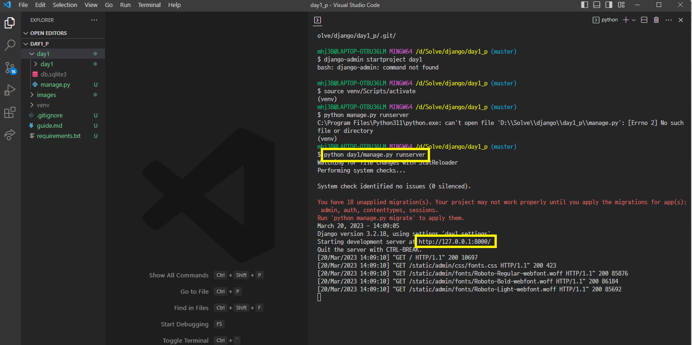

# 230320 Django_1

## Django - Understanding Django and framework

### Framework
- Framework
  - 웹 애플리케이션을 빠르게 개발할 수 있도록 도와주는 도구
  - 개발에 필요한 기본 구조, 규칙, 라이브러리 등을 제공

- 사용 이유
  - 기본적인 구조와 규칙을 제공하기 때문에 필수적인 개발에만 집중할 수 있음
  - 여러 라이브러리를 제공해 개발 속도를 빠르게 할 수 있음
  - 유지보수와 확장에 용이해 소프트웨어의 품질을 높임

### django
- Python 기반의 대표적인 웹 프레임워크

### 클라이언트와 서버
- Client: 서비스를 요청하는 주체(웹 사용자의 인터넷이 연결된 장치, 웹 브라우저)
- Server: 클라이언트의 요청에 응답하는 주체

### django 프로젝트 및 가상환경
1. 가상환경 생성
    ```
    python -m venv venv
    ```

    

<br>

2. 가상환경 활성화
    ```
    source venv/Scripts/activate
    ```

    

<br>

3. django 설치
    ```
    pip install django==3.2.18
    ```

    

    

<br>

4. 의존성 파일 생성
    ```
    pip freeze > requirements.txt
    ```

    

<br>

5. .gitignore 설정

    

<br>

6. git init

<br>

7. 프로젝트 생성
    ```
    django-admin startproject <name>
    ```

    

<br>

8. 서버 실행
    ```
    python manage.py runserver
    ```

    

    

- 가상환경을 사용하는 이유
  - 의존성 관리
    - 라이브러리 및 패키지를 각 프로젝트마다 독립적으로 사용 가능
  - 팀 프로젝트 협업
    - 모든 팀원이 동일한 환경과 의존성 위에서 작업하여 버전간 충돌을 방지