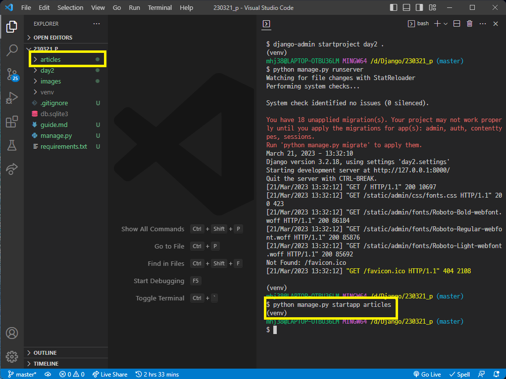

# 230321 Django_2

## Django - Django design pattern

### django 프로젝트와 앱

- django project : 애플리케이션의 집합
  - DB 설정, URL 연결, 전체 앱 설정 등을 처리
- django application : 독립적으로 작동하는 기능 단위 모듈
  - 각자 특정한 기능을 담당하며 다른 앱들과 함께 하나의 프로젝트를 구성
  - MTV 패턴에 해당하는 파일 및 폴더를 담당

### guide
1. ~ 8. [가상환경 및 프로젝트 생성 guide](https://github.com/JiSuMun/TIL/blob/master/KDT_Multicampus/W13/230320.md)

9. 앱 생성
    ```
    python manage.py startapp articles
    ```

    

    - 앱의 이름은 복수형 권장장

<br>

10. 앱 등록

    

    - 앱 생성 후 등록해야 함 

### django 디자인 패턴
- MVC 디자인 패턴 (Model - View - Controller)
  - 애플리케이션을 구조화하는 대표적인 패턴 
  - 시각적 요소와 뒤에서 실행하는 로직을 서로 영향 없이, 독립적이고 쉽게 유지보수할 수 있는 애플리케이션을 만들기 위해 사용

- MTV 디자인 패턴 (Model - Template - View)
  - django에서 애플리케이션을 구조화하는 패턴

- 프로젝트 구조 (pjt 폴더)
  - settings.py: 프로젝트의 모든 설정을 관리
  - urls.py: URL과 이에 해당하는 적절한 views를 연결
  - __ init __.py: 해당 폴더를 패키지로 인식하도록 설정
  - asgi.py: 비동기식 웹 서버와의 연결 관련 설정
  - wsgi.py: 웹 서버와의 연결 관련 설정
  - manage.py: Django 프로젝트와 다양한 방법으로 상호작용 하는 커맨드라인 유틸리티

- 앱 구조 (articles 폴더)
  - admin.py: 관리자용 페이지 설정
  - models.py: DB와 관련된 Model을 정의
  - views.py: HTTP 요청을 처리하고 해당 요청에 대한 응답을 반환
  - apps.py: 앱의 정보가 작성된 곳
  - tests.py: 프로젝트 테스트 코드를 작성하는 곳

### 요청과 응답
- URLs
  ```python
  from django.contrib import admin
  from django.urls import path

  from articles import views

  urlpatterns = [
      path('admin/', admin.site.urls),
      path('articles/', views.index)
  ]
  ```

- View
  ```python
  from django.shortcuts import render

  # Create your views here.
  def index(request):
      return render(request, 'index.html')
  ```

- Template
  - articles 앱 폴더 안 templates 폴더 생성 후 템플릿 페이지 작성

- 데이터 흐름에 따른 코드 작성
  - URLs => View => Template

---

- MTV
  - Model
    - 데이터와 관련된 로직을 관리
    - 응용프로그램의 데이터 구조를 정의하고 데이터베이스의 기록을 관리

  - Template
    - 레이아웃과 화면을 처리
    - 화면상의 사용자 인터페이스 구조와 레이아웃을 정의

  - View
    - Model, Template과 관련한 로직을 처리해서 응답을 반환
    - 클라이언트의 요청에 대해 처리를 분기하는 역할

      => 데이터 필요 -> model 접근하여 데이터 가져옴 -> template로 보내 화면 구성 -> 구성된 화면을 응답으로 만들어 클라이언트에게 반환