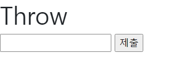

# 230322 Django_3

## Django - Django Template

### Template System

- django template system
    - 데이터 표현을 제어하면서, 표현과 관련된 로직을 담당

- HTML 컨텐츠 => 변수 값에 따라 변화

  ```python
  from django.shortcuts import render
  def index(request):
      context = {
          'name': 'Harry',
      }
      return render(request, 'articles/index.html', context)
  ```

  ```html
  <body>
    <h1>Hello, {{ name }}!!</h1>
  </body>
  ```

    

- Django Template Language(DTL)
  - Template에서 조건, 반복, 변수, 필터 등의 프로그래밍적 기능을 제공하는 시스템
  - syntax
    1. Variable
    2. Filters
    3. Tags
    4. Comments

- Variable
  - view 함수에서 render 함수의 세 번째 인자, 딕셔너리 타입으로 넘겨 받을 수 있음
  - 딕셔너리 key에 해당하는 문자열이 template에서 사용 가능한 변수명이 됨
  ```django
  {{ variable}}
  ```

- Filters
  - 표시할 변수를 수정할 때 사용
  ```django
  {{ variable|filter }}
  ```

- Tags
  - 반복 또는 논리를 수행하여 제어 흐름을 만드는 등 변수보다 복잡한 일들을 수행
  - 일부 태그는 시작과 종료 태그가 필요
  ```django
  
  ```

- Comments
  - DTL에서의 주석 표현
  ```django
  
    <h1>Hello</h1>
  
  ```

- DTL 실습
  ```python
  # urls.py
  urlpatterns = [
      path('admin/', admin.site.urls),
      path('dinner/', views.dinner),
  ]
  ```
  ```python
  # views.py
  def dinner(request):
      foods = ['볶음밥', '보쌈', '서브웨이', '햄버거',]
      context = {
          'foods': foods,
      }
      return render(request, 'articles/dinner.html', context)
  ```
  ```html
  

  
    <h1>DTL 실습</h1>
    <h3>메뉴판</h3>
    <p>{{ foods }}</p>

    <ul>
      
        <li>{{ food }}</li>
      
    </ul>

    
      <p>메뉴가 남아있지 않습니다.</p>
    
      <p>메뉴가 아직 남아있습니다.</p>
    
  
  ```

    

### 템플릿 상속
- 템플릿 상속(Template inheritance)
  - 페이지의 공통요소를 포함하고, 하위 템플릿이 재정의 할 수 있는 공간을 정의하는 기본 ‘skeleton’ 템플릿을 작성하여 상속 구조를 구축
    
  ```html
  # base.html - 부트스트랩 적용
  <!doctype html>
  <html lang="en">
  <head>
    <meta charset="utf-8">
    <meta name="viewport" content="width=device-width, initial-scale=1">
    <link href="https://cdn.jsdelivr.net/npm/bootstrap@5.3.0-alpha1/dist/css/bootstrap.min.css" rel="stylesheet" integrity="sha384-GLhlTQ8iRABdZLl6O3oVMWSktQOp6b7In1Zl3/Jr59b6EGGoI1aFkw7cmDA6j6gD" crossorigin="anonymous">
    <title>Document</title>
    
    
  </head>
  <body>
    
    
    <script src="https://cdn.jsdelivr.net/npm/bootstrap@5.3.0-alpha1/dist/js/bootstrap.bundle.min.js" integrity="sha384-w76AqPfDkMBDXo30jS1Sgez6pr3x5MlQ1ZAGC+nuZB+EYdgRZgiwxhTBTkF7CXvN" crossorigin="anonymous"></script>
  </body>
  </html>
  ```

### 요청과 응답
- ‘form’ element
  - 사용자로부터 할당된 데이터를 서버로 전송
  - 웹에서 사용자 정보를 입력하는 여러 방식(text, password 등)을 제공

- ‘action’ & ‘method’
  - 데이터를 어디(action)로 어떤 방식(method)으로 보낼지
  - action
    - 입력 데이터가 전송될 URL을 지정(목적지)
    - 만약 이 속성을 지정하지 않으면 데이터는 현재 form이 있는 페이지의 URL로 보내짐
  - method
    - 데이터를 어떤 방식으로 보낼 것인지 정의
    - 데이터의 HTTP request methods (GET, POST)를 지정

- ‘input’ element
  - 사용자의 데이터를 입력 받을 수 있는 요소 (type 속성 값에 따라 다양한 유형의 입력 데이터를 받음)

- ‘name’ : input의 핵심 속성
  - 데이터를 제출했을 때 서버는 name 속성에 설정된 값을 통해 사용자가 입력한 데이터에 접근할 수 있음

- 검색 페이지 실습
  ```python
  # urls.py
  urlpatterns = [
      path('admin/', admin.site.urls),
      path('search/', views.search),
  ]
  ```
  ```python
  # views.py
  def search(request):
      return render(request, 'articles/search.html')
  ```
  ```html
  

  
    <h1>Form 실습</h1>
    <form action="https://search.naver.com/search.naver" method="GET">
      <label for="message">검색어 : </label>
      <input type="text" name="query" id="message">
      <input type="submit">
    </form>
  
  ```

    

- Query String Parameters
  - form 실습에서 django 입력 및 제출 뒤 url 변화 확인
    ```markdown
    https://search.naver.com/search.naver?query=django

    목적지 URL ? input의 name(query) + input에 입력한 데이터(django)
    ```
  - 사용자의 입력 데이터를 URL 주소에 파라미터를 통해 넘기는 방법
  - 문자열은 앰퍼샌드(&)로 연결된 key=value 쌍으로 구성되며, 기본 URL과 물음표(?)로 구분됨
    - 예시
      ```markdown
      http://host:port/path?key=value&key=value
      ```

- 사용자 입력 데이터를 받아 그대로 출력하는 서비스 실습

- throw
  ```python
  # urls.py
  urlpatterns = [
      path('admin/', admin.site.urls),
      path('throw/', views.throw),
  ]
  ```
  ```python
  # views.py
  def throw(request):
      return render(request, 'articles/throw.html')
  ```
  ```html
  

  
    <h1>Throw</h1>
    <form action="/catch/" method="GET">
      <input type="text" name="message">
      <input type="submit">
    </form>
  
  ```
    

- catch
  ```python
  # urls.py
  urlpatterns = [
      path('admin/', admin.site.urls),
      path('catch/', views.catch),
  ]
  ```
  ```python
  # views.py
  def catch(request):
      data = request.GET.get('message')
      context = {
          'data': data,
      }
      return render(request, 'articles/catch.html', context)
  ```
  ```html
  

  
    <h1>Catch</h1>
    <h1>{{ data }}를 받았습니다!</h1>
  
  ```
    