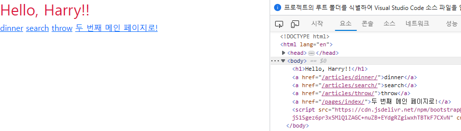

# 230323 Django_4

## Django - Django URLs

- URL dispatcher (운항 관리자, 분배기)
  - URL 패턴을 정의하고 해당 패턴이 일치하는 요청을 처리할 view 함수를 연결(매핑)

### 변수와 URL
- 템플릿의 많은 부분이 중복되고, URL의 일부만 변경되는 상황 => Variable Routing

- Variable Routing
  - URL 일부에 변수를 포함시키는 것
  - 변수는 view 함수의 인자로 전달 할 수 있음
  - <path_converter:variable_name>
  - Path converters
    - URL 변수의 타입을 지정 (str, int 등 5가지 타입 지원)
    - [URL dispatcher | Django 문서 | Django (djangoproject.com)](https://docs.djangoproject.com/ko/3.2/topics/http/urls/#path-converters)

- Variable Routing 실습1
  ```python
  # urls.py
  urlpatterns = [
      path('<int:num>/', views.detail),
  ]
  ```
  ```python
  # views.py
  def detail(request, num):
      context = {
          'num': num,
      }
      return render(request, 'articles/detail.html', context)
  ```
  ```html
  <!-- articles/detail.html -->
  


  
    <h1>Detail</h1>
    <h3>지금은 {{ num }}번 글입니다.</h3>
  
  ```

    


- Variable Routing 실습2
  ```python
  # urls.py
  urlpatterns = [
      path('hello/<str:name>/', views.greeting)
  ]
  ```
  ```python
  # views.py
  def greeting(request, name):
      context = {
          'name': name
      }
      return render(request, 'articles/greeting.html', context)
  ```
  ```html
  <!-- articles/greeting.html -->
  

  
    <h1>Greeting</h1>
    <h3>{{ name }}님 안녕하세요.</h3>
  
  ```

    


### App의 URL
- App URL mapping
  - 각 앱에 URL을 정의하는 것
    - 프로젝트와 각각의 앱이 URL을 나누어 관리하여 주소 관리를 편하게 하기 위함

- 기존 => 변화된 urls.py
  ```python
  # firstpjt/urls.py
  from django.contrib import admin
  from django.urls import path, include

  urlpatterns = [
      path('admin/', admin.site.urls),
      path('articles/', include('articles.urls')),
      path('pages/', include('pages.urls')),
  ]
  ```

- 변화
  ```python
  # articles/urls.py
  from django.urls import path
  # 명시적 상대경로 (django 권장사항)
  from . import views

  urlpatterns = [
      path('index/', views.index),
      path('dinner/', views.dinner),
      path('search/', views.search),
      path('throw/', views.throw),
      path('catch/', views.catch),
      path('<int:num>/', views.detail),
      path('hello/<str:name>/', views.greeting),
  ]
  ```
  ```python
  # pages/urls.py
  from django.urls import path
  from . import views

  urlpatterns = [
      path('index/', views.index),
  ]
  ```

- include()
  - 다른 URL들을 참조할 수 있도록 돕는 함수
  - URL의 그 시점까지 일치하는 부분을 잘라내고, 남은 문자열 부분을 후속 처리를 위해 include된 URL로 전달

### URL 이름 지정

- Naming URL patterns
  - URL에 이름을 지정하는 것 (path 함수의 name 인자를 정의해서 사용)
  ```python
  # articles/urls.py
  from django.urls import path
  # 명시적 상대경로 (django 권장사항)
  from . import views

  urlpatterns = [
      path('index/', views.index, name='index'),
      path('dinner/', views.dinner, name='dinner'),
      path('search/', views.search, name='search'),
      path('throw/', views.throw, name='throw'),
      path('catch/', views.catch, name='catch'),
      path('<int:num>/', views.detail, name='detail'),
      path('hello/<str:name>/', views.greeting, name='greeting'),
  ]
  ```
  - 기존 ‘articles/’ 주소가 ‘articles/index/’로 변경됨
    - 기존에 articles/ 주소를 사용했던 모든 위치를 찾아 변경해야 함
  ```python
  # pages/urls.py
  from django.urls import path
  from . import views

  urlpatterns = [
      path('index/', views.index, name='index'),
  ]
  ```
- ‘url’ tag
  - 주어진 패턴의 이름과 일치하는 절대 경로 주소를 반환
  - 

  ```html
  <!-- articles/index.html -->
  

  
    <style>
      h1 { 
        color: crimson;
      }
    </style>
  

  
    <h1>Hello, {{ name }}!!</h1>
    <a href="dinner">dinner</a>
    <a href="search">search</a>
    <a href="throw">throw</a>
    <a href="index">두 번째 메인 페이지로!</a>
  
  ```
  ```html
  <!-- articles/index.html -->
    

  
    <style>
      h1 { 
        color: crimson;
      }
    </style>
  

  
    <h1>Hello, {{ name }}!!</h1>
    <a href="">dinner</a>
    <a href="">search</a>
    <a href="">throw</a>
    <a href="">두 번째 메인 페이지로!</a>
  
  ```
  - url 태그 변경 후 브라우저 출력 확인

    

### URL Namespace
- URL 이름 지정 후 => 두 개의 앱의 url이름이 같으므로 문제 발생
  => app_name 필요

- app_name 속성 지정
  - url 이름 + app 이름표 붙이기
  ```python
  # articles/urls.py
  from django.urls import path
  from . import views

  app_name = 'articles'
  urlpatterns = [
      path('index/', views.index, name='index'),
      path('dinner/', views.dinner, name='dinner'),
      path('search/', views.search, name='search'),
      path('throw/', views.throw, name='throw'),
      path('catch/', views.catch, name='catch'),
      path('<int:num>/', views.detail, name='detail'),
      path('hello/<str:name>/', views.greeting, name='greeting')
  ]
  ```
  ```python
  # pages/urls.py
  from django.urls import path
  from . import views

  app_name = 'pages'
  urlpatterns = [
      path('index/', views.index, name='index'),
  ]
  ```

- app_name 지정 후 url tag 의 변화
  ```html
  <!-- articles/index.html -->
    

  
    <style>
      h1 { 
        color: crimson;
      }
    </style>
  

  
    <h1>Hello, {{ name }}!!</h1>
    <a href="">dinner</a>
    <a href="">search</a>
    <a href="">throw</a>
    <a href="">두 번째 메인 페이지로!</a>
  
  ```
    ```html
  <!-- articles/index.html -->
  

  
    <style>
      h1 { 
        color: crimson;
      }
    </style>
  

  
    <h1>Hello, {{ name }}!!</h1>
    <a href="">dinner</a>
    <a href="">search</a>
    <a href="">throw</a>
    <a href="">두 번째 메인 페이지로!</a>
  
  ```