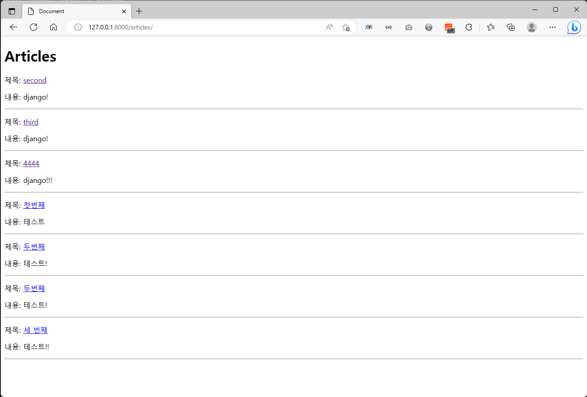
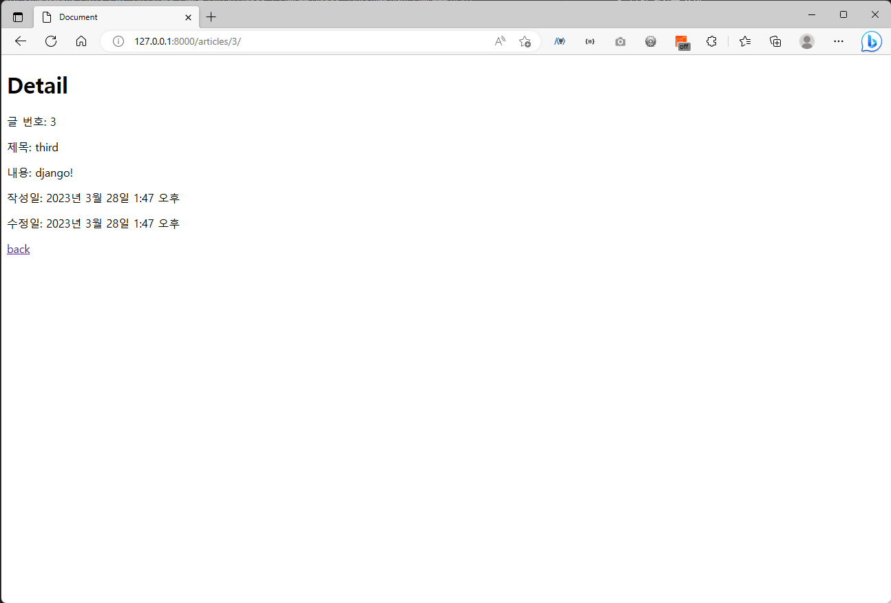
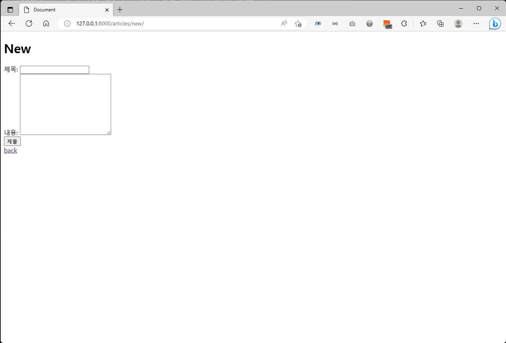
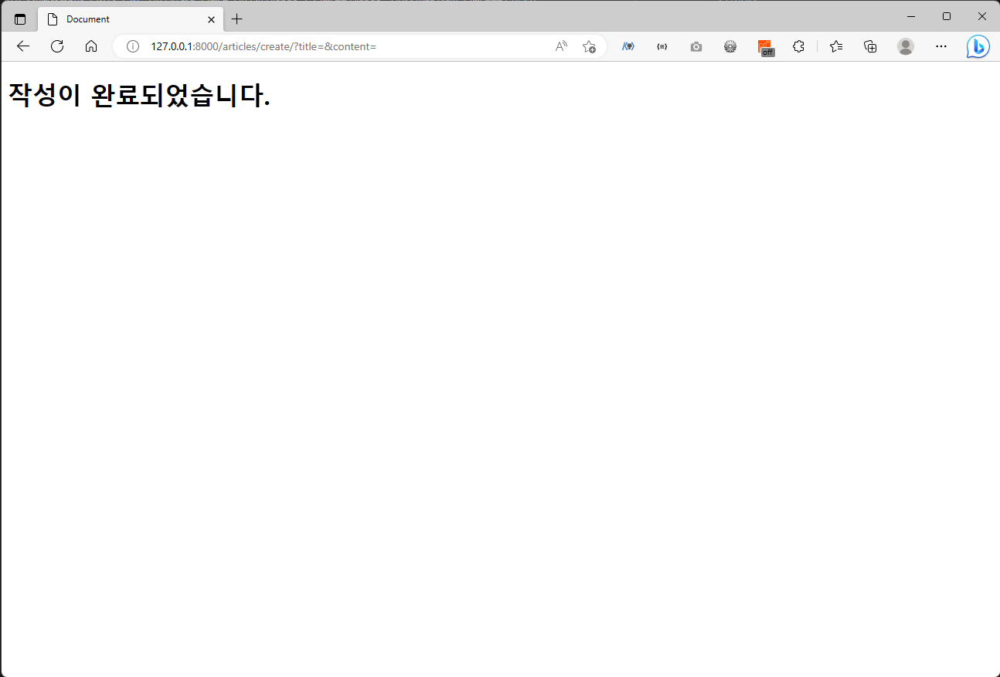

# 230329 Django_7

## Django - ORM with view

### READ
- 전체 게시글 조회
  ```python
  # articles/urls.py
  from django.urls import path
  from . import views

  app_name = 'articles'
  urlpatterns = [
      path('', views.index, name = 'index')
  ]
  ```
  ```python
  # articles/views.py
  from django.shortcuts import render
  from .models import Article

  def index(request):
      articles = Article.objects.all()
      context = {
          'articles': articles,
      }
      return render(request, 'articles/index.html', context)
  ```
  ```html
  <!-- articles/index.html -->
  <h1>Articles</h1>
  
    <p>제목: 
      <a href="">{{ article.title }}</a>
    </p>
    <p>내용: {{ article.content }}</p>
    <hr>
  
  ```

    


- 단일 게시글 조회
  ```python
  # articles/urls.py
  from django.urls import path
  from . import views
  app_name = 'articles'
  urlpatterns = [
      path('<int:pk>/', views.detail, name='detail'),
  ]
  ```
  ```python
  # articles/views.py
  from django.shortcuts import render
  from .models import Article

  def detail(request, pk):
      article = Article.objects.get(pk=pk)
      context = {
          'article': article,
      }
      return render(request, 'articles/detail.html', context)    
  ```
  ```html
  <!-- articles/detail.html -->
  <h1>Detail</h1>
  <p>글 번호: {{ article.pk }}</p>
  <p>제목: {{ article.title }}</p>
  <p>내용: {{ article.content }}</p>
  <p>작성일: {{ article.created_At }}</p>
  <p>수정일: {{ article.updated_at }}</p>
  <a href="">[back]</a>
  ```

    

### CREATE
- Create 로직을 구현하기 위해 필요한 view 함수
  - 사용자의 입력을 받는 페이지를 렌더링: new
  - 사용자가 입력한 데이터를 받아 DB에 저장: create

- new
  ```python
  # articles/urls.py
  from django.urls import path
  from . import views
  app_name = 'articles'
  urlpatterns = [
    path('new/', views.new, name='new'),
  ]
  ```
  ```python
  # articles/views.py
  from django.shortcuts import render
  from .models import Article

  def new(request):
    return render(request, 'articles/new.html')
  ```
  ```html
  <!-- articles/new.html -->
  <h1>New</h1>
  <form action="" method='GET'>
    <div>
      <label for="title">제목: </label>
      <input type="text" name='title' id='title'>
    </div>
    <div>
      <label for="content">내용: </label>
      <textarea name="content" id="content" cols="30" rows="10"></textarea>
    </div>
    <input type="submit">
  </form>
  <a href="">back</a>
  ```

    


- create
  ```python
  # articles/urls.py
  from django.urls import path
  from . import views
  app_name = 'articles'
  urlpatterns = [
    path('create/', views.create, name='create'),
  ]
  ```
  ```python
  # articles/views.py
  from django.shortcuts import render
  from .models import Article

  def create(request):
    title = request.GET.get('title')
    content = request.GET.get('content')

    article = Article(title=title, content=content)
    article.save()

    return render(request, 'articles/create.html')
  ```
  ```html
  <!-- articles/create.html -->
  <h1>작성이 완료되었습니다.</h1>
  ```

    