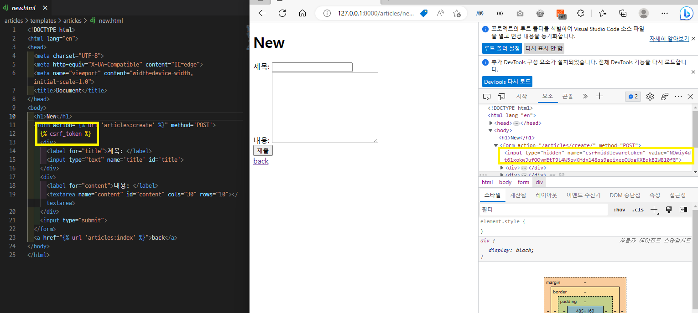
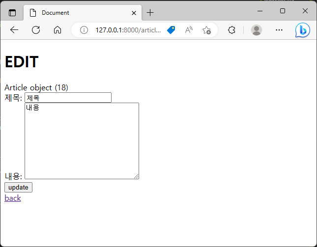

# 230330 Django_8

## Django - ORM with view_DELETE, UPDATE

- redirect()
  - 인자에 작성된 주소로 다시 요청을 보냄

- ‘GET’ Method
  - 특정 리소스를 조회하는 요청 (GET으로 데이터를 전달하면 Query String 형식으로 보내짐)
  - 반드시 데이터를 가져올 때만 사용해야 함

- ‘POST’ Method
  - 특정 리소스에 변경사항을 만드는 요청 (POST로 데이터를 전달하면 HTTP Body에 담겨 보내짐)
  - 403 에러
    - CSRF 토큰이 누락

- CSRF(Cross-Site-Request-Forgery)
  - 사이트 간 요청 위조
  - 사용자가 자신의 의지와 무관하게 공격자가 의도한 행동을 하여 특정 웹 페이지를 보안에 취약하게 하거나 수정, 삭제 등의 작업을 하게 만드는 공격 방법

    

### DELETE
- DELETE 로직 작성
  ```python
  # articles/urls.py
  from django.urls import path
  from . import views

  app_name = 'articles'
  urlpatterns = [
      path('', views.index, name = 'index'),
      path('<int:pk>/', views.detail, name='detail'),
      path('<int:pk>/delete/', views.delete, name='delete'),
  ]

  ```
  ```python
  # articles/views.py
  def delete(request, pk):

    article = Article.objects.get(pk=pk)

    article.delete()

    return redirect('articles:index')
  ```
  ```html
  <!-- articles/detail.html -->
  <h1>Detail</h1>
  <p>글 번호: {{ article.pk }}</p>
  <p>제목: {{ article.title }}</p>
  <p>내용: {{ article.content }}</p>
  <p>작성일: {{ article.created_At }}</p>
  <p>수정일: {{ article.updated_at }}</p>
  <form action="" method="POST">
    
    <input type="submit" value="삭제">
  </form>
  <a href="">back</a>
  ```

### UPDATE
- UPDATE 로직을 구현하기 위해 필요한 view 함수
  - 사용자의 입력을 받는 페이지를 렌더링 ⇒ edit
  - 사용자가 입력한 데이터를 받아 DB에 저장 ⇒ update

- edit 로직
  ```python
  # articles/urls.py
  from django.urls import path
  from . import views

  app_name = 'articles'
  urlpatterns = [
      path('<int:article_pk>/edit/', views.edit, name='edit'),
  ]

  ```
  ```python
  # articles/views.py
  def edit(request, article_pk):
    article = Article.objects.get(pk=article_pk)

    context = {
        'article': article
    }
    return render(request, 'articles/edit.html', context)
  ```
  ```html
  <!-- articles/edit.html -->
  <h1>EDIT</h1>
  <form action="#" method='POST'>
    
    <div>
      <label for="title">제목: </label>
      <input type="text" name='title' id='title' value="{{ article.title }}">
    </div>
    <div>
      <label for="content">내용: </label>
      <textarea name="content" id="content" cols="30" rows="10">{{ article.content }}</textarea>
    </div>
    <input type="submit" value='update'>
  </form>
  <a href="">back</a>
  ```
  ```html
  <!-- articles/detail.html -->
  <h1>Detail</h1>
  <p>글 번호: {{ article.pk }}</p>
  <p>제목: {{ article.title }}</p>
  <p>내용: {{ article.content }}</p>
  <p>작성일: {{ article.created_At }}</p>
  <p>수정일: {{ article.updated_at }}</p>
  <form action="" method="POST">
    
    <input type="submit" value="삭제">
  </form>
  <a href="">EDIT</a>
  <a href="">back</a>
  ```

    

- update 로직 작성

  ```python
  # articles/urls.py
  from django.urls import path
  from . import views

  app_name = 'articles'
  urlpatterns = [
      path('<int:article_pk>/update/', views.update, name="update"),
  ]

  ```
  ```python
  # articles/views.py
  def update(request, article_pk):

    article = Article.objects.get(pk=article_pk)

    title = request.POST.get('title')
    content = request.POST.get('content')

    article.title = title
    article.content = content

    article.save()

    return redirect('articles:detail', article.pk)
  ```
  ```html
  <!-- articles/edit.html -->
  <h1>EDIT</h1>
  <form action="" method='POST'>
    
    <div>
      <label for="title">제목: </label>
      <input type="text" name='title' id='title' value="{{ article.title }}">
    </div>
    <div>
      <label for="content">내용: </label>
      <textarea name="content" id="content" cols="30" rows="10">{{ article.content }}</textarea>
    </div>
    <input type="submit" value='update'>
  </form>
  <a href="">back</a>
  ```