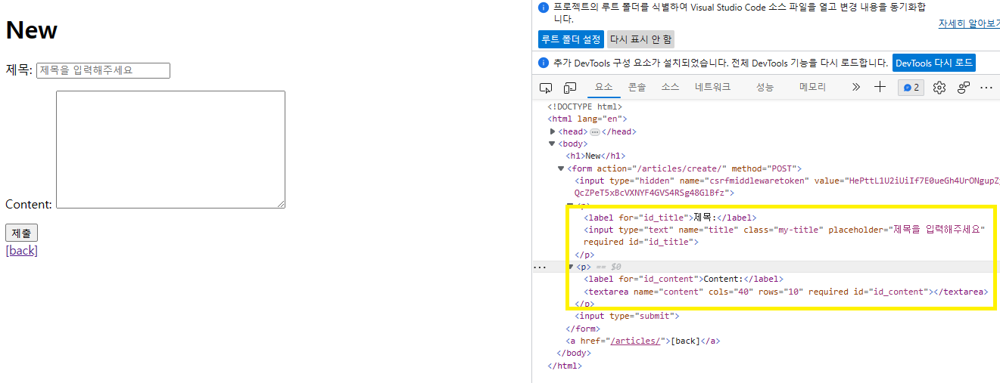
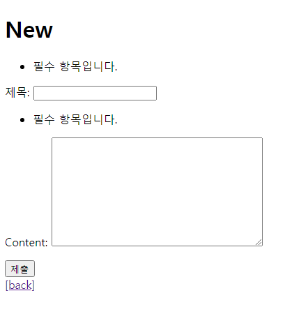
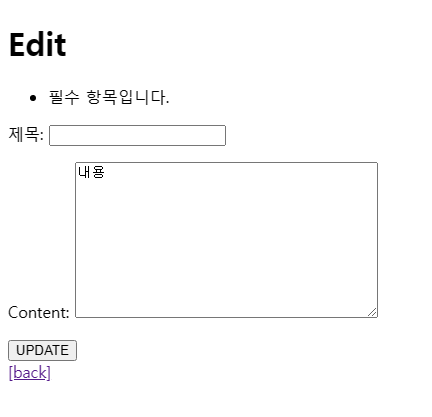

# 230403 Django_9

## Django - Form + Handling http requests
- HTML form
  - 사용자로부터 form 요소를 통해 데이터를 받고 있으나 비정상적 혹은 악의적인 요청을 확인하지 않고 모두 수용중
  - 우리가 원하는 데이터 형식이 맞는지에 대한 ‘유효성 검증’ 필요
- 유효성 검사
  - 수집한 데이터가 정확하고 유효한지 확인하는 과정
  - 유효성 검증에는 입력 값, 형식, 중복, 범위, 보안 등 부가적인 많은 것들을 고려해야 함
  - 이런 과정과 기능을 제공해주는 도구가 필요

### Django Form
- Django Form
  - 사용자 입력 데이터를 수집하고, 처리 및 유효성 검증을 수행하기 위한 도구
  - 유효성 검사를 단순화하고 자동화할 수 있는 기능을 제공

- Form class 선언 (Widget 사용)
  ```python
  # articles/forms.py
  from django import forms
  from .models import Article
  class ArticleForm(forms.ModelForm):
      title = forms.CharField(
          label='제목',
          widget=forms.TextInput(
              attrs={
                  'class': 'my-title',
                  'placeholder': '제목을 입력해주세요',
              }
          )
      )
      class Meta:
          model = Article
          fields = '__all__'
  ```

  ```python
  # articles/views.py
  def create(request):
      # HTTP requests method가 POST라면
      if request.method == 'POST':
          form = ArticleForm(request.POST)
          if form.is_valid():
              article = form.save()
              return redirect('articles:detail', article.pk)
      # POST가 아니라면
      else:
          form = ArticleForm()
      context = {
          'form': form,
      }
      return render(request, 'articles/new.html', context)
  ```

  ```html
  <!-- articles/new.html -->
  <body>
    <h1>New</h1>
    <form action="" method="POST">
      
      {{ form.as_p }}
      <input type="submit">
    </form>
    <a href="">[back]</a>
  </body>
  ```

    

### Widgets

- HTML ‘input’ element의 표현을 담당
  - input 요소의 속성 및 출력되는 부분을 변경하는 것
- [참고](https://docs.djangoproject.com/ko/3.2/ref/forms/widgets/#built-in-widgets)

### Django ModelForm

- Form
  - 사용자 입력 데이터를 DB에 저장하지 않을 때 (ex. 로그인)

- ModelForm
  - 사용자 입력 데이터를 DB에 저장해야 할 때 (ex.회원가입)

- Meta class
  - ModelForm의 정보를 작성하는 곳

- fields 및 exclude 속성
  - exclude 속성을 사용하여 모델에서 포함하지 않을 필드를 지정할 수도 있음
  ```python
  class ArticleForm(forms.ModelForm):
      class Meta:
          model = Article
          # fields = ('content',)
          # exclude = ('title',)
  ```

- ModelForm을 적용한 create 로직 (HTTP requests methods를 사용해서 함수 합침 new+create)
  ```python
  # articles/views.py
  def create(request):
      if request.method == 'POST':
          form = ArticleForm(request.POST)
          if form.is_valid():
              article = form.save()
              return redirect('articles:detail', article.pk)
      else:
          form = ArticleForm()
      context = {
          'form': form,
      }
      return render(request, 'articles/new.html', context)
  ```
  - input에 공백 값 입력 후 에러 메시지 (유효성 검사 결과)

    

- is_valid()
  - 여러 유효성 검사를 실행하고, 데이터가 유효한지 여부를 boolean으로 변환

- ModelForm을 적용한 update 로직 (HTTP requests methods를 사용해서 함수 합침 edit+update)
  ```python
  # articles/views.py
  def update(request, article_pk):
      article = Article.objects.get(pk=article_pk)
      form = ArticleForm(request.POST, instance=article)
      if request.method == 'POST':
          if form.is_valid():
              article = form.save()
              return redirect('articles:detail', article.pk)
      else:
          form = ArticleForm(instance=article)
      context = {
      'article': article,
      'form': form,
      }

      return render(request, 'articles/edit.html', context)
  ```

  ```html
  <!-- articles/edit.html -->
  <h1>Edit</h1>
    <form action="" method="POST">
      
      {{ form.as_p }}
      <input type="submit" value="UPDATE">
    </form>
  <a href="">[back]</a>
  ```
  - input에 공백 값 입력 후 에러 메시지 (유효성 검사 결과)

    

- save()
  - 데이터베이스 객체를 만들고 저장
  - 키워드 인자 instance 여부를 통해 생성할 지, 수정할 지를 결정