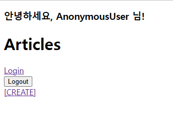
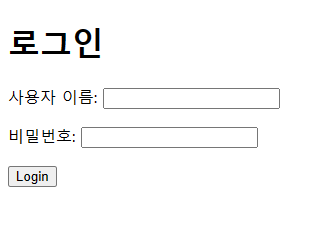
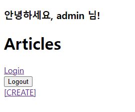

# 230404 Django_11

## Django - Authentication System 1

- Django  Authentication System (인증 시스템)
  - 사용자 인증과 관련된 기능을 모아 놓은 시스템
  - 인증과 권한 부여를 함께 제공 및 처리
  - settings.py - INSTALLED APPS 에 django.contrib.auth로 존재

- Authentication (인증)
  - 신원 확인

- Authorization (권한, 허가)
  - 권한 부여

- auth와 관련한 경로나 키워드들을 django 내부적으로 accounts라는 이름으로 사용하고 있기 때문에 되도록 accounts로 지정하는 것을 권장

### Custom User model

- Custom User model로 대체하기
  - django가 기본적으로 제공하는 User model은 내장된 auth 모듈의 User 클래스를 적용
  - [https://github.com/django/django/blob/main/django/contrib/auth/models.py#L405](https://github.com/django/django/blob/main/django/contrib/auth/models.py#L405)
  - 별도의 설정 없이 사용할 수 있어 간편하지만, 직접 수정할 수 없는 문제
  ```python
  # accounts/models.py
  from django.contrib.auth.models import AbstractUser

  class User(AbstractUser):
      pass
  ```
  - AbstractUser를 상속받는 커스텀 User 클래스 작성

  ```python
  # settings.py
  AUTH_USER_MODEL = 'accounts.User'
  ```

  ```python
  # accounts/admin.py
  from django.contrib import admin

  from django.contrib.auth.admin import UserAdmin
  from .models import User

  admin.site.register(User, UserAdmin)
  ```
  - 기본 User 모델이 아니기 때문에 등록하지 않으면 admin site에 출력되지 않음
  - 프로젝트 중간에 AUTH_USER_MODEL을 변경할 수 없음
    - 이미 진행한 경우 데이터베이스 초기화 후 진행 필요
    - migrations 폴더 내의 숫자 붙은 파일 + db.sqlite3 파일 삭제 후 migrate

### Login & Logout
- Login
  - Session을 Create 하는 과정

- AuthenticationsForm()
  - 로그인을 위한 built-in form
  - [https://github.com/django/django/blob/main/django/contrib/auth/forms.py#L174](https://github.com/django/django/blob/main/django/contrib/auth/forms.py#L174)

- login(request, user)
  - 인증된 사용자를 로그인 하는 함수

- get_user()
  - AuthenticationForm의 인스턴스 메서드
  - 유효성 검사를 통과했을 경우 로그인 한 사용자 객체를 반환
  - [https://github.com/django/django/blob/main/django/contrib/auth/forms.py#L244](https://github.com/django/django/blob/main/django/contrib/auth/forms.py#L244)

- Logout
  - Session을 Delete하는 과정

- logout(request)
  1. 현재 요청에 대한 session data을 DB에서 삭제
  2. 클라이언트의 쿠키에서도 sessionid를 삭제

- 로그인&로그아웃 로직 작성   
  ```python
  # accounts/urls.py
  from django.urls import path
  from . import views
  
  app_name = 'accounts'
  urlpatterns = [
      path('login/', views.login, name='login'),
      path('logout/', views.logout, name='logout'),   
  ]
  ```
  
  ```python
  # accounts/views.py
  from django.shortcuts import render, redirect
  from django.contrib.auth.forms import AuthenticationForm
  from django.contrib.auth import login as auth_login
  from django.contrib.auth import logout as auth_logout
  
  # Create your views here.
  def login(request):
      if request.method == 'POST':
          form = AuthenticationForm(request, request.POST)
          if form.is_valid():
              auth_login(request, form.get_user())
              return redirect('articles:index')
      else:
          form = AuthenticationForm()
      context = {
          'form': form,
      }
      return render(request, 'accounts/login.html', context)
  
  def logout(request):
      auth_logout(request)
      return redirect('articles:index')
  ```
  
  ```html
  <!-- accounts/login.html -->
  <h1>로그인</h1>
  <form action="" method="POST">
    
    {{ form.as_p }}
    <input type="submit">
  </form>
  ```
  
  ```html
  <!-- articles/index.html -->
  <a href="">Login</a>  
  <form action="" method="POST">
    
    <input type="submit" value="Logout">
  </form>
  ```

    
    

### Template with Authentication data

- 현재 로그인 되어있는 유저 정보 출력하기
  ```html
  <!-- articles/index.html -->
  <h3>안녕하세요, {{ user }} 님!</h3>
  ```

    