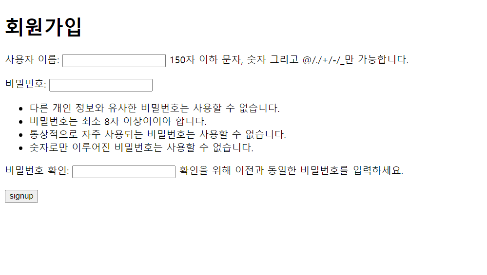
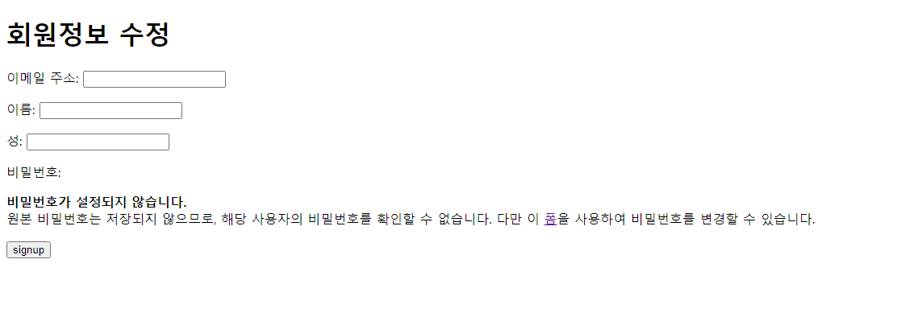

# 230405 Django_12

## Django - Authentication System 2

- 모델폼은 첫번째 인자가 데이터
- 폼은 첫번째 인자가 request
- 폼과 모델폼의 부모 클래스가 다름
- render: 보통 get
- redirect: 보통 post

### 회원 가입

- UserCreationForm()
  - 회원 가입을 위한 built-in ModelForm

- 회원 가입 페이지 작성
  ```python
  # accounts/urls.py
  from django.urls import path
  from . import views

  app_name = 'accounts'
  urlpatterns = [
      path('signup/', views.signup, name="signup"),
  ]
  ```

  ```python
  # accounts/views.py
  from .forms import CustomUserCreationForm

  def signup(request):
      if request.user.is_authenticated:
          return redirect('articles:index')
      if request.method == 'POST':
          form = CustomUserCreationForm(request.POST)
          if form.is_valid():
              form.save()
              return redirect('articles:index')
      else:
          form = CustomUserCreationForm()
      context = {
          'form': form,
      }
      return render(request, 'accounts/signup.html', context)
  ```

  - 회원가입 후 로그인까지 진행하려면
      
      ```python
      # accounts/views.py
      from .forms import CustomUserCreationForm
      
      def signup(request):
          if request.user.is_authenticated:
              return redirect('articles:index')
          if request.method == 'POST':
              form = CustomUserCreationForm(request.POST)
              if form.is_valid():
                  user = form.save()
                  auth_login(request, user)
                  return redirect('articles:index')
          else:
              form = CustomUserCreationForm()
          context = {
              'form': form,
          }
          return render(request, 'accounts/signup.html', context)
      ```
      

  ```html
  <!-- accounts/signup.html -->
  <h1>회원가입</h1>
  <form action="" method="POST">
    
    {{ form.as_p }}
    <input type="submit" value="signup">
  </form>
  ```
  - views.py 에 from django.contrib.auth.forms import UserCreationForm 를 적용하면 `Manager isn't available; 'auth.User' has been swapped for 'accounts.User'` 오류 발생
    - UserCreationForm이 우리가 대체한 커스템 유저 모델이 아닌 기존 유저 모델로 인해 작성된 클래스이기 때문
    - 커스텀 유저 모델을 사용하려면 다시 작성해야 하는 forms
      - UserCreationForm, UserChangeForm
        - class Meta: model = User가 등록된 form이기 때문
      - 커스텀 Form 작성
        ```python
        # accounts/forms.py
        from django.contrib.auth.forms import UserCreationForm, UserChangeForm
        from django.contrib.auth import get_user_model
        
        class CustomUserCreationForm(UserCreationForm):
            class Meta(UserCreationForm.Meta):
                model = get_user_model()
        
        class CustomUserChangeForm(UserChangeForm):
            class Meta(UserChangeForm.Meta):
                model = get_user_model()
        ```
  - 결과

    

- get_user_model()
  - 현재 프로젝트에서 활성화된 사용자 모델 (active user model)을 반환하는 함수

- User 모델을 직접 참조하지 않는 이유
  - User 모델을 get_user_model()을 사용해 참조하면 커스텀 User 모델을 자동으로 반환해주기 때문
  - Django는 User 클래스를 직접 참조하는 대신 get_user_model()을 사용해 참조해야 한다고 강조

### 회원 탈퇴

- 회원 탈퇴 로직 작성 
  ```python
  # accounts/urls.py
  from django.urls import path
  from . import views
  
  app_name = 'accounts'
  urlpatterns = [
      path('delete/', views.delete, name="delete"),
  ]
  ```
  
  ```python
  # accounts/views.py
  from django.contrib.auth.decorators import login_required
  
  @login_required
  def delete(request):
      request.user.delete()
      return redirect('articles:index')
  ```
  
  - 탈퇴 하면서 유저의 세션 정보도 함께 지우고 싶은 경우
      
      ```python
      # accounts/views.py
      from django.contrib.auth.decorators import login_required
      
      @login_required
      def delete(request):
          request.user.delete()
          auth_logout(request)
          return redirect('articles:index')
      ```
  ```html
  <!-- accounts/index.html -->
  <form action="" method="POST">
    
    <input type="submit" value="회원탈퇴">
  </form>
  ```

### 회원정보 수정

- UserChangeForm()
  - 회원 가입을 위한 built-in ModelForm

- 회원정보 수정 페이지 작성
  ```python
  # accounts/urls.py
  from django.urls import path
  from . import views

  app_name = 'accounts'
  urlpatterns = [
      path('update/', views.update, name="update"),
  ]
  ```

  ```python
  # accounts/views.py
  from django.contrib.auth.decorators import login_required

  @login_required
  def update(request):
      if request.method == 'POST':
          form = CustomUserChangeform(request.POST, instance=request.user)
          if form.is_valid():
              form.save()
              return redirect('articles:index')
      else:
          form = CustomUserChangeform()
      context = {
          'form': form,
      }
      return render(request, 'accounts/update.html', context)
  ```

  ```html
  <!-- accounts/update.html -->
  <h1>회원정보 수정</h1>
  <form action="" method="POST">
    
    {{ form.as_p }}
    <input type="submit" value="signup">
  </form>
  ```

  - UserChangeForm 사용 시 문제점
      - 일반 사용자가 접근해서는 안 될 정보들(fields)까지 모두 수정이 가능해짐
      - admin 인터페이스에서 사용되는 ModelForm이기 때문
      - 따라서 CustomUserChangeForm에서 접근 가능한 필드를 조정해야 함
      
      ```python
      # accounts/forms.py
      class CustomUserChangeForm(UserChangeForm):
          class Meta(UserChangeForm.Meta):
              model = get_user_model()
              fields = ('email', 'first_name', 'last_name',)
      ```
  - 결과

    

### 비밀번호 변경

- PasswordChangeForm()
  - 비밀번호 변경을 위한 built-in form

- 비밀번호 변경 페이지 작성
  ```python
  # accounts/urls.py
  from django.urls import path
  from . import views

  app_name = 'accounts'
  urlpatterns = [
      path('password/', views.change_password, name="change_password"),
  ]
  ```

  ```python
  # accounts/views.py
  from django.contrib.auth import update_session_auth_hash
  from django.contrib.auth.decorators import login_required

  @login_required
  def change_password(request):
      if request.method == 'POST':
          form = PasswordChangeForm(request.user, request.POST)
          if form.is_valid():
              user = form.save()
              update_session_auth_hash(request, user)
              return redirect('articles:index')
      else:
          form = PasswordChangeForm(request.user)
      context = {
          'form': form
      }
      return render(request, 'accounts/change_password.html', context)
  ```

  ```html
  <!-- accounts/update.html -->
  <h1>비밀번호 변경</h1>
  <form action="" method="POST">
    
    {{ form.as_p }}
    <input type="submit" value="signup">
  </form>
  ```

- update_session_auth_hash(request, user)
  - 암호 변경 시 세션 무효화 방지
  - 암호가 변경되어도 로그아웃 되지 않도록 새로운 password의 session data로 기존 session을 업데이트

### 로그인 사용자에 대한 접근 제한
- is_authenticated : 속성

  - 로그인과 비로그인 상태에서 출력되는 링크를 다르게 설정 
    ```html
    <!-- articles/index.html -->
    
      <h3>안녕하세요, {{ user }} 님!</h3>
      <form action="" method="POST">
        
        <input type="submit" value="Logout">
      </form>
      
      <form action="" method="POST">
        
        <input type="submit" value="회원탈퇴">
      </form>
    
      <a href="">회원정보수정</a>
    
      <a href="">Login</a>
      <a href="">회원가입</a>
    
    ```
    
  - 인증된 사용자라면 로그인/회원가입 로직을 수행할 수 없도록 views에 추가
    ```python
    if request.user.is_authenticated:
        return redirect('articles:index')
    ```

- login_required : 데코레이터
  - 인증된 사용자에 대해서만 views 함수를 실행시키는 데코레이터
  - 인증된 사용자만 게시글을 작성/수정/삭제 할 수 있도록, 로그아웃/탈퇴/수정/비밀번호 변경 할 수 있도록 views.py에 추가
    ```python
    from django.contrib.auth.decorators import login_required
    
    @login_required
    ```