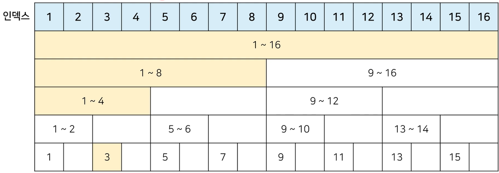
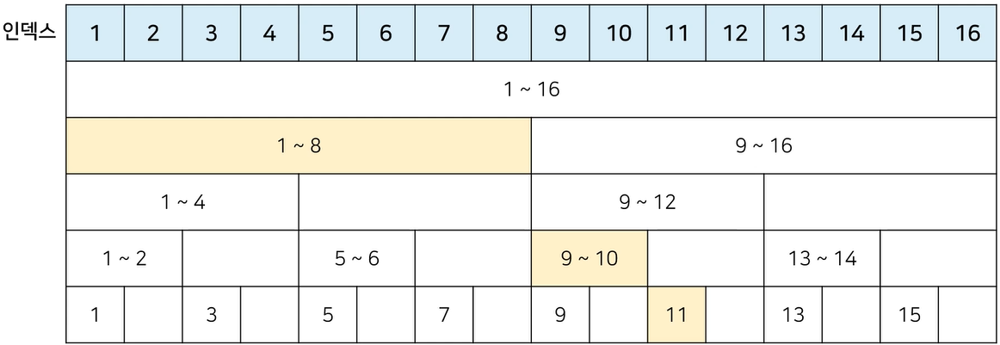
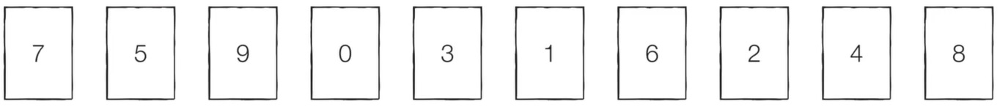

# [큐레이팅# 플러스]최적의 코딩을 결정하는 기본 알고리즘

## 특수한 목적의 자료구조: 바이너리 인덱스 트리

- 바이너리 인덱스 트리(Binary Indexed Tree)
    - 2진법 인덱스 구조를 활용해 구간 합 문제를 효과적으로 해결해 줄 수 있는 자료구조
        - 펜윅 트리(fenwick tree)라고도 함
    - 0이 아닌 마지막 비트를 찾는 법
        - 특정한 숫자 K의 0이 아닌 마지막 비트를 찾기 위해서 K & -K를 계산하면 됨

- K & -K 계산 결과 예시
    ```python
    n = 8
    for i in range(n + 1):
	    print(i, "의 마지막 비트:", (i & -i))
    
    # 실행 결과
    # 0의 마지막 비트: 0
    # 1의 마지막 비트: 1
    # 2의 마지막 비트: 2
    # 3의 마지막 비트: 1
    # 4의 마지막 비트: 4
    # 5의 마지막 비트: 1
    # 6의 마지막 비트: 2
    # 7의 마지막 비트: 1
    # 8의 마지막 비트: 8
    ```

- 바이너리 인덱스 트리: 트리 구조 만들기
    - 0이 아닌 마지막 비트 = 내가 저장하고 있는 값들의 개수

- 바이너리 인덱스 트리: 업데이트(Update)
    - 특정 값을 변경할 때: 0이 아닌 마지막 비트만큼 더하면서 구간들의 값을 변경 (에시 = 3rd)
    

- 바이너리 인덱스 트리: 누적 합(Prefix Sum)
    - 1부터 N까지의 합(누적 합) 구하기: 0이 아닌 마지막 비트만큼 빼면서 구간들의 값의 합 계산 (예시 = 11th)
    

- 바이너리 인덱스 트리 구현
    ```python
    import sys
    input = sys,stdin.readline

    # 데이터의 개수(n), 변경 횟수(m), 구간 합 계산 횟수(k)
    n, m, k = map(int, input().split())

    # 전체 데이터의 개수는 최대 1,000,000개
    arr = [0] * (n + 1)
    tree = [0] * (n + 1)

    # i번째 수까지의 누적 합을 계산하는 함수
    def prefix_sum(i):
        result = 0
        while i > 0:
            result += tree[i]
            # 0이 아닌 마지막 비트만큼 빼가면서 이동
            i -= (i & -i)
        return result

    # i번째 수를 dif만큼 더하는 함수
    def update(i, dif):
        while i <= n:
            tree[i] += dif
            i += (i & -i)
    # start부터 end까지의 구간 합을 계산하는 함수
    def interval_sum(start, end):
        return prefix_sum(end) - prefix_sum(start - 1)

    for i in range(1, n + 1):
        x = int(input())
        arr[i] = x
        update(i, x)

    for i in range(m + k):
        a, b, c = map(int, input().split())
        # 업데이트(update) 연산인 경우
        if a == 1:
            update(b, c -arr[b]) # 바뀐 크기(dif)만큼 적용
            arr[b] = c
        # 구간 합(interval sum) 연산인 경우
        else:
            print(interval_sum(b, c))
    ```
---

## 간단하면서 기본적인 정렬 알고리즘: 선택 정렬과 삽입 정렬

- 정렬 알고리즘
    - 정렬(Sorting): 데이터를 특정한 기준에 따라 순서대로 나열하는 것
    - 일반적으로 문제 상황에 따라서 적절한 정렬 알고리즘이 공식처럼 사용됨



- `선택 정렬`

    - `처리되지 않은 데이터 중에서 가장 작은 데이터를 선택해 맨 앞에 있는 데이터와 바꾸는 것을 반복함`
    - 동작 예시(위 이미지 참고)
        - [Step 0] 처리되지 않은 데이터 중 가장 작은 ‘0’을 선택해 가장 앞의 ‘7’과 바꿈
        - [Step 1] 처리되지 않은 데이터 중 가장 작은 ‘1’을 선택해 가장 앞의 ‘5’와 바꿈
        - 이러한 과정을 반복

    - 선택 정렬의 시간 복잡도
        - 선택 정렬은 `N번 만큼 가장 작은 수를 찾아서 맨 앞으로 보내야 한다.`
            - 구현 방식에 따라서 사소한 오차는 있을 수 있지만, 전체 연산 횟수는 다음과 같다.
                - N + (N - 1) + (N - 2) + … + 2
            - 이는 $(N^2 + N -2) / 2$ 로 표현할 수 있는데, 빅오 표기법에 따라서 $O(N^2)$이라고 작성함

    - 선택 정렬 소스코드
        ```python
        array = [7, 5, 9, 0, 3, 1, 6, 2, 4, 8]

        for i in range(len(array)):
            min_index = i # 가장 작은 원소의 인덱스
            for j in range(i + 1, len(array)):
                if array[min_index] > array[j]:
                    min_index = j
            array[i], array[min_index] = array[min_index], array[i] # 스와프

        print(array)

        # 실행 결과
        # [0, 1, 2, 3, 4, 5, 6, 7, 8, 9]
        ```

- `삽입 정렬`

    - 처리되지 않은 데이터를 하나씩 골라 적절한 위치에 삽입
    - 선택 정렬에 비해 구현 난이도가 높은 편이지만, 일반적으로 더 효율적으로 동작함

    - 동작 예시(위 이미지 참고)
        - [Step 0] 첫 번째 데이터 ‘7’은 `그 자체로 정렬이 되어 있다고 판단`하고, 두 번째 데이터인 ‘5’가 어떤 위치로 들어갈지 판단함. ‘7’의 왼쪽으로 들어가거나 오른쪽으로 들어가거나 두 경우만 존재
        - [Step 1] 이어서 ‘9’가 어떤 위치로 들어갈지 판단함
        - 이러한 과정을 반복

    - 삽입 정렬의 시간 복잡도
        - 삽입 정렬의 시간 복잡도는 $O(N^2)$이며, 선택 정렬과 마찬가지로 반복문이 두 번 중첩되어 사용됨
        - 삽입 정렬은 현재 리스트의 데이터가 거의 정렬되어 있는 상태라면 매우 빠르게 동작함
            - `최선의 경우 O(N)의 시간 복잡도를 가짐`
            - 이미 정렬되어 있는 상태에서 다시 삽입 정렬 수행?
                - 시간 복잡도: O(N)
    
    - 삽입 정렬 소스코드
        ```python
        array = [7, 5, 9, 0, 3, 1, 6, 2, 4, 8]

        for i in range(1, len(array)):
            for j in range(i, 0, -1): # 인덱스 i부터 1까지 1씩 감소하며 반복하는 문법
                if array[j] < array[j - 1]: # 한 칸씩 왼족으로 이동
                    array[j], array[j - 1] = array[j - 1], array[j]
                else: # 자기보다 작은 데이터를 만나면 그 위치에서 멈춤
                    break

        print(array)

        # 실행 결과
        # [0, 1, 2, 3, 4, 5, 6, 7, 8, 9]
        ```