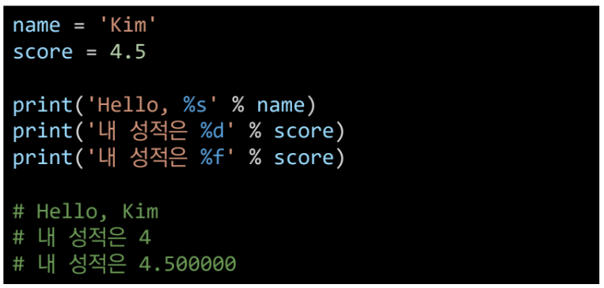
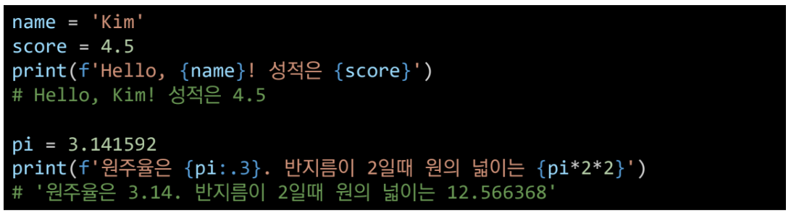

# 230103 학습내용 총정리

## Python 제어문

- String Fomatting

    - String Interpolation

        - 문자열을 변수를 활용하여 만드는 법
            - %-formatting
            

            - f-string
            

---

- 형 변환(Typecasting)

    - 암시적 형 변환(Implict)
    - 명시적 형 변환(Explict)

---

### 제어문(Control Statement)

- 파이썬은 기본적으로 위에서부터 아래로 순차적으로 명령을 수행

- 조건문(Conditional Statement)
    - 참/거짓을 판단할 수 있는 조건식과 함께  사용
    - if, else

- 복수 조건문
    - 복수의 조건식을 활용할 경우 elif를 활용
    - `조건식을 동시에 검사하는 것이 아니라 순차적으로 비교`

- 중첩 조건문
    - 들여쓰기를 유의하여 작성할 것

---
- 레인지(Range)

    - range(n=0, m, s=1)

    - 기본형: range(n)
        - 0부터 n-1가지의 숫자의 시퀀스

    - 범위 지정: range(n, m)
        - n부터 m-1까지의 숫자의 시퀀스

    - 범위 및 스텝 지정: range(n, m, s)
        - n부터 m-1가지 s만큼 증가시키며 숫자의 시퀀스

---
- 반복문(Loop Statement)

    - 특정 조건을 도달할 때까지, 계속 반복되는 일련의 문장

    - **`for 문`**

        - 반복가능한 객체를 모두 순회하면 종료(별도의 종료조건이 필요 없음)
    
---

- 반복문 제어

    - break
        - 반복문을 종료

    - continue
        - continue 이후의 코드 블록은 수행하지 않고, 다음 반복을 수행
        
    - for-else
        - 끝까지 반복문을 실행한 이후에 else문 실행
            - break를 통해 중간에 종료되는 경우 else 문은 실행되지 않음